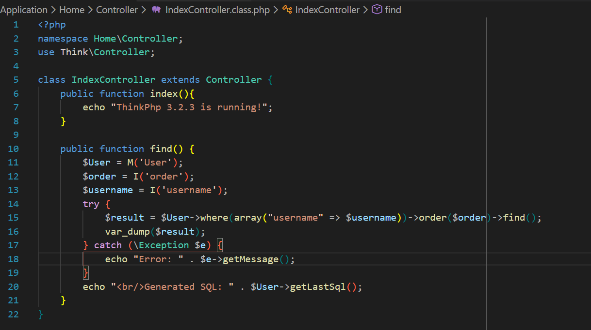
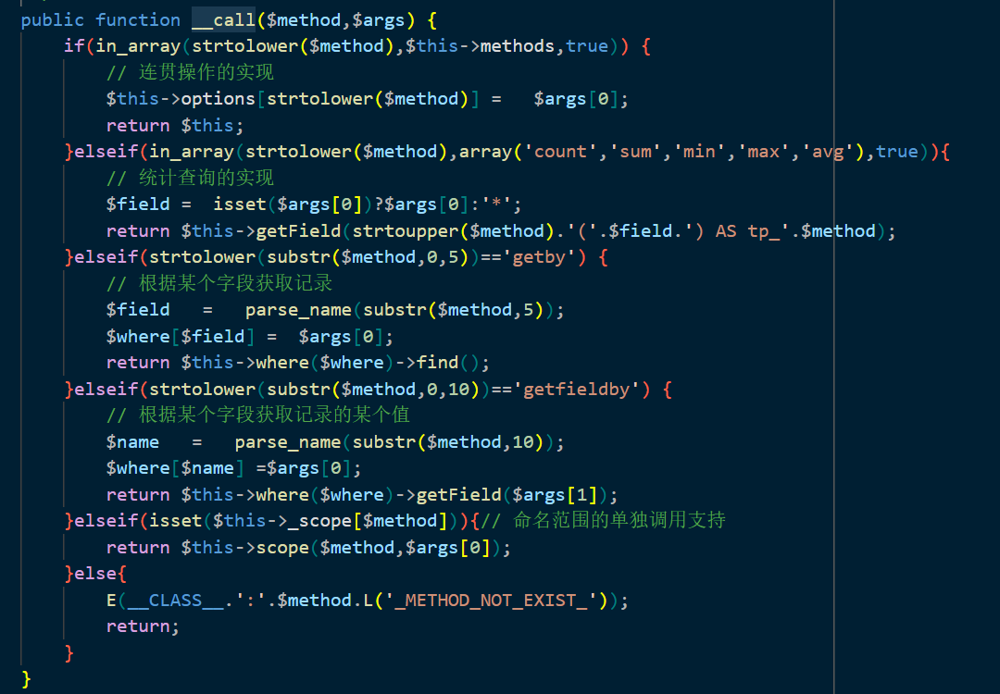
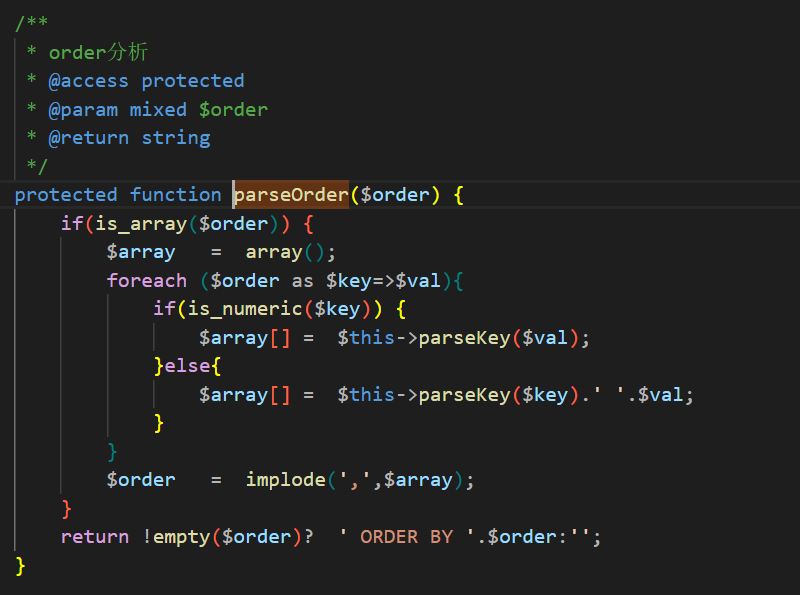

## 漏洞影响

- **受影响版本**：ThinkPHP ≤ 3.2.3 或 ≤ 5.1.22

## 漏洞分析

ThinkPHP ≤ 3.2.3 或 ≤ 5.1.22 版本在处理用户可控的 ORDER BY 排序参数时，由于框架未对输入值进行充分的转义和验证，允许攻击者注入恶意 SQL 片段，从而导致 SQL 注入漏洞。该漏洞源于框架的链式查询机制中对排序条件的直接拼接，绕过了标准的安全过滤。

## 漏洞复现

1. 漏洞主要源于 `order()` 方法的链式调用，其中排序参数未经验证直接传入底层 SQL 构建逻辑。

2. 查询 Model 类源代码可知，该类未显式定义 `order()` 方法；PHP 将触发 `__call()` 魔术方法。分析 `__call()` 实现，发现 `order($order)` 调用匹配第一个分支条件：`$method` 为触发魔术方法的名称，`$args[0]` 为传入的排序参数。随后，`$this->options[strtolower($method)] = $args[0];` 将排序值直接赋值至 `$this->options['order']`。

3. `return $this;` 确保链式操作的连续性。随后，`find()` 方法执行时，对 `$this->options['order']` 参数无特殊处理，直至调用底层数据库驱动的 `$this->db->select($options);` 方法。

4. 在 Driver 类的 `select()` 方法中，调用 `$this->buildSelectSql($options);`，进而触发 `$this->parseSql($this->selectSql, $options);`。`parseSql()` 方法负责解析并替换 SQL 模板中的占位符表达式。

5. `parseSql()` 方法调用 `$this->parseOrder()`，传入参数为三元表达式：若 `$options['order']` 存在，则传递原值；否则为空字符串。该步骤将排序条件直接注入 SQL 构建流程。

6. `parseOrder()` 方法检查传入参数是否为数组；若非数组，则直接拼接 `' ORDER BY ' . $order . '';` 并返回。该返回值被 `parseSql()` 进一步融入最终 SQL 语句，导致未过滤的用户输入直接执行，引发 SQL 注入。

7. 构造请求参数：`username=test1&order=id%20and%20(updatexml(1,concat(0x7e,(select%20user()),0x7e),1))`，成功注入并执行数据库函数，验证漏洞有效性。

