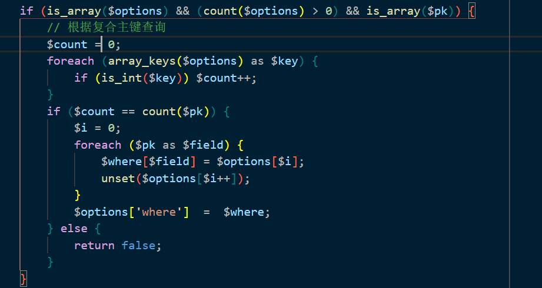
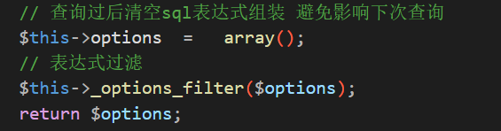
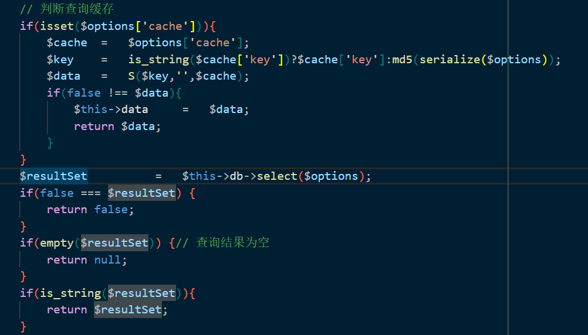
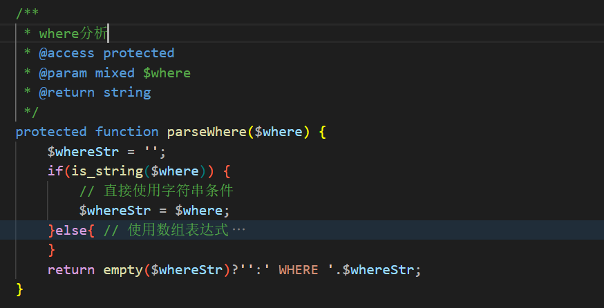
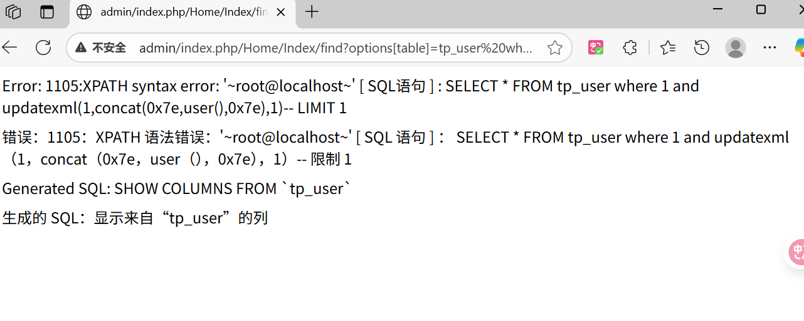

## 漏洞影响

`<= 3.2.3`

## 漏洞分析

ThinkPHP 3.2.3 中的 SQL 注入漏洞（主要影响 `Model::find()`、`Model::delete()` 和 `Model::select()` 方法）源于对用户可控的参数处理不严谨，特别是对 `table`、`alias` 和 `where` 等键值的解析和 SQL 拼接过程缺乏充分的过滤、转义和验证。该漏洞允许攻击者通过构造数组类型的参数，注入恶意 SQL 片段，从而读取敏感数据、执行任意查询。

## 漏洞复现

1.  首先下载ThinkPHP 3.2.3的压缩包，编写测试Controller，以下用 `Model::find()` 来进行验证，`Model::select()` 和 `Model::find()` 几乎一样。
  
    
    
2.  漏洞入口是 `Model::find($options)` 方法，`find($options = array())` 方法接受 `$options` 作为查询条件数组。如果 `$options` 是数字或字符串（如主键 ID），则自动转换为 `where` 条件。如果攻击者传入数组类型的 `$options`，此分支不执行，直接进入后续逻辑。
  
    
    
3.  对于单主键表，`$pk` 是字符串，非数组，因此不进入复合主键分支。攻击者只需针对单主键表构造数组 `$options`，即可直接跳过此检查，进入通用解析。
  
    
    
4.  始终设置 `$options['limit'] = 1`，然后调用 `$options = $this->_parseOptions($options);` 进行表达式解析。
  
    
    
5.  在 `_parseOptions` 方法中，`table`、`alias`、`where` 无任何预过滤。比如，如果攻击者设置 `$options['table']` 为恶意字符串（如 `'tp_user UNION SELECT 1,@@version,3-- '`），直接使用。`$options['alias']` 可控，直接追加到 `table` 后（如 `'tp_user AS t1 UNION SELECT ...--'`）。如果 `$options['where']` 是字符串而非数组，整个验证分支不执行，直接通过。
  
    
    
6.  最后清空 `$this->options = array();`，调用 `_options_filter($options)`（默认空方法，无实际过滤）。
  
    
    
7.  解析后调用 `$this->db->select($options);`，底层构建并执行 SQL。
  
    
    
8.  在 `Driver.class.php` 的 `select` 方法中，直接使用解析后的 `$options` 构建 SQL。`parseBind` 仅处理绑定参数，但注入发生在字符串直接拼接时，`bind` 无关。
  
    
    
9.  `buildSelectSql` 处理分页 `limit`，然后调用 `parseSql` 替换模板占位符。
  
    
    
10. SQL 是模板字符串（如 `'SELECT %DISTINCT% %FIELD% FROM %TABLE% %WHERE% ...'`），通过 `str_replace` 替换。注入片段直接嵌入，无过滤。
  
    
    
11. 如果 `$options['table']` 是字符串（如 `'tp_user UNION SELECT 1,@@version,3--'`），`explode(',')` 分割为 `['tp_user UNION SELECT 1', '@@version,3--']`，然后每个片段调用 `parseKey` 方法，`parseKey` 没有做任何处理，直接返回参数。最终 `implode` 拼接回完整注入字符串，嵌入 `FROM` 子句，导致 `FROM tp_user UNION SELECT 1,@@version,3--`。
  
    
    
12. `$where` 如果是字符串 则直接赋值 `$whereStr = $where;`，无转义、无正则验证。攻击者设置 `$options['where'] = '1=1 UNION SELECT ...--'`，直接生成 `WHERE 1=1 UNION SELECT ...--`，追加查询或绕过条件。
  
    
    
13. 最后的 `Db::query($str)` 方法通过绑定仅替换占位符为转义值。但注入发生在字符串直接拼接，无占位符，因此 `bind` 和 `escapeString` 不生效。PDO `prepare` 也仅防注入占位符；恶意 `$str` 已含完整注入 SQL，`prepare`/`execute` 直接执行，导致数据泄露或任意查询。
  
    
    
14. 注入语句如下，`alias`、`where` 等数组键的注入同理。
  
    
    
15. `Model::delete()` 则有些改变，代码中有对 `if(empty($options['where'])){` 的判断，如果为空则直接 `return false` 并不进行sql解析，因此对 `delete` 进行注入需要保持 `where` 不为空。
  
    