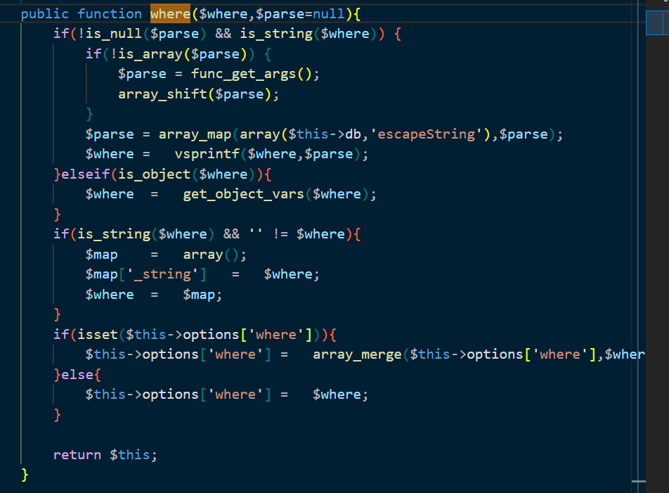
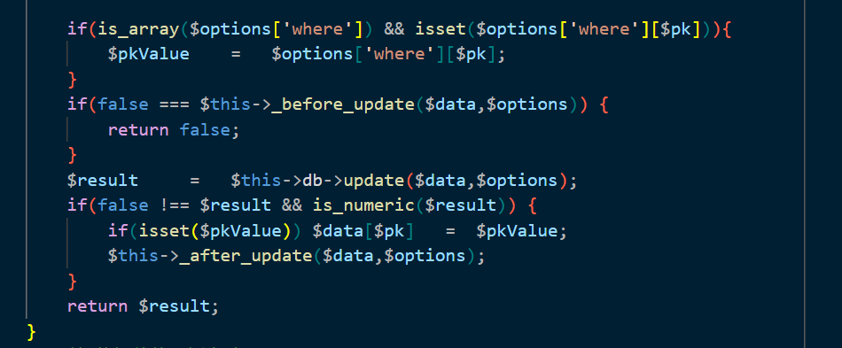
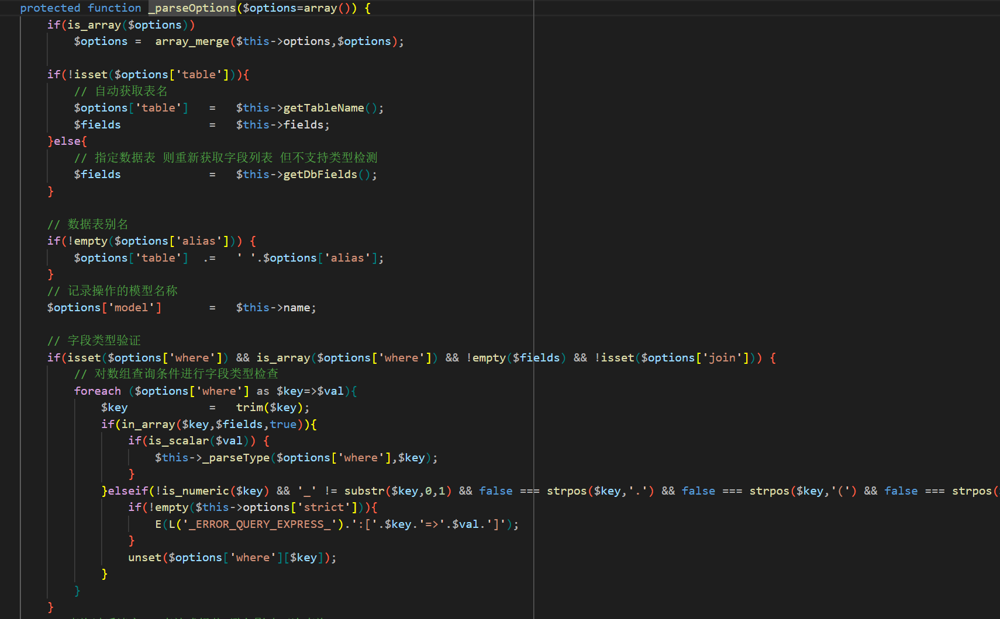
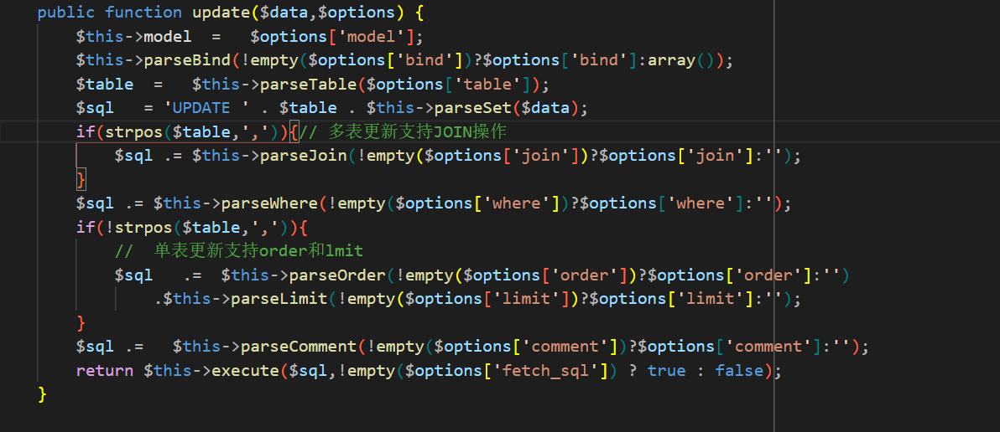
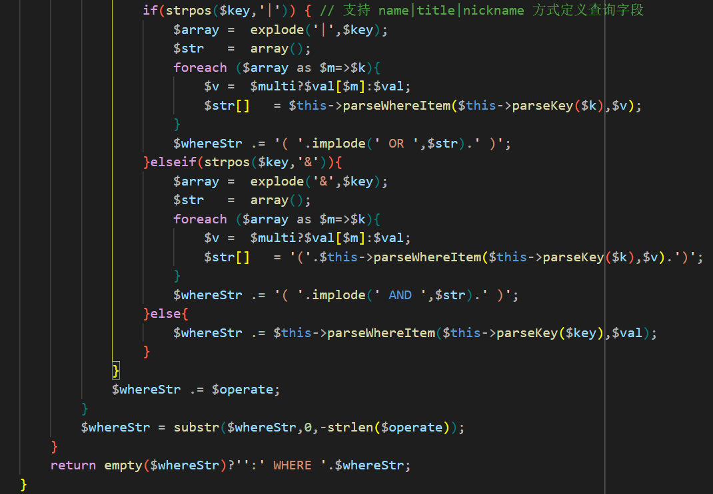
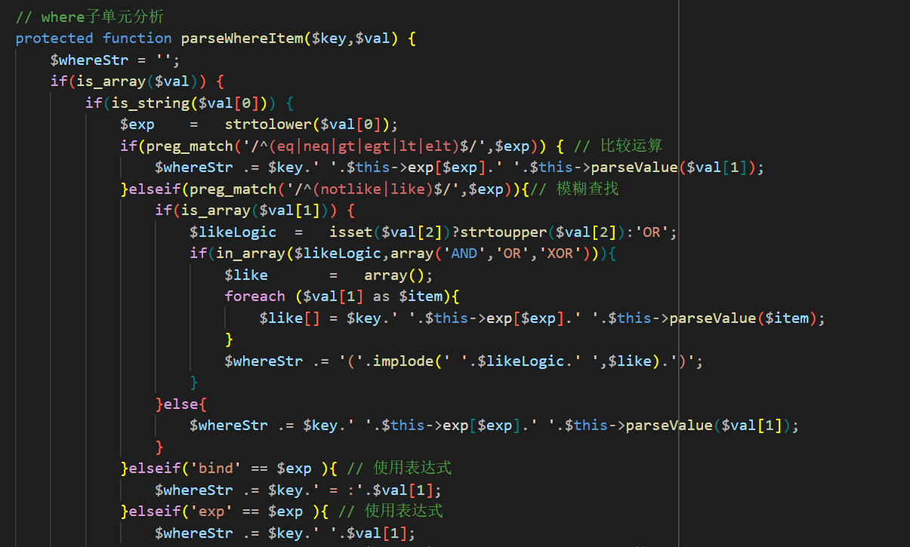
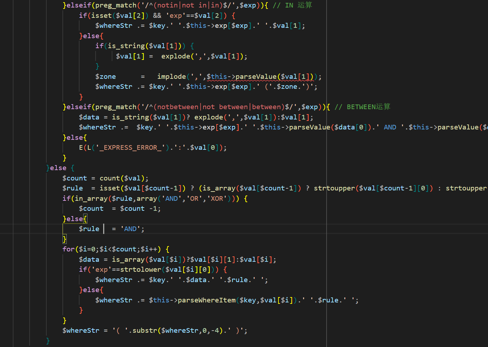
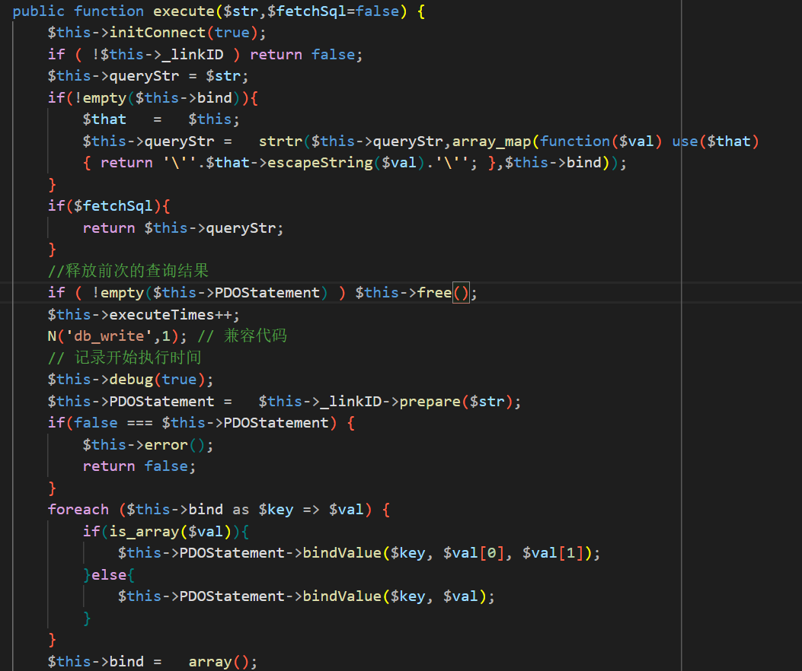

## 漏洞影响
- **版本范围**：≤ 3.2.3

## 漏洞分析
ThinkPHP 3.2.3 在数据库 UPDATE 操作中存在 SQL 注入漏洞，主要源于 `where` 条件处理中的 `bind` 表达式不当拼接，以及后续执行阶段的占位符替换机制（`strtr` 函数）可被利用。该漏洞允许攻击者通过控制 `bind` 表达式的参数名，覆盖框架内部的顺序绑定参数，导致恶意 SQL 片段被注入到 WHERE 子句中执行。

## 漏洞复现
以下是基于官方开发方式的完整调用链，从输入到 SQL 执行。假设主键为 `id`，表为 `member`，正常更新用户金钱和名称。用户输入：`money[]=1123&user=liao&id[0]=bind&id[1]=0%20and%20(updatexml(1,concat(0x7e,(select%20user()),0x7e),1))`。  
- `I('money')` → `['1123']`（数组）。  
- `I('user')` → `'liao'`（字符串）。  
- `I('id')` → `['bind', '0 and (updatexml(1,concat(0x7e,(select user()),0x7e),1))']`（数组）。  

我们使用 `I` 函数来获取参数，`I()` 函数的 `think_filter` 只对字符串值检查特定表达式（如 `EXP`），对数组不生效。使用数组形式（如 `id[]=bind&id[]=0 and ...`）即可绕过。

### 1. where 方法分析
该方法共有 5 个分支：  
- **第一个 if**：`if(!is_null($parse) && is_string($where))`，该分支逻辑用 `func_get_args()` 收集额外参数，对其应用 `$this->db->escapeString()` 转义，然后 `vsprintf()` 格式化替换占位符（如 `%d` → 转义后的 `1`），生成安全的字符串 where。但我们的 where 传参是数组，因此跳过该逻辑。  
- **第二个 elseif**：`elseif(is_object($where))`，该分支逻辑将传入对象转换为数组，数组输入不会触发此分支。  
- **第三个 if**：`if(is_string($where) && '' != $where)`，数组输入跳过。  

最后的 `if/else`：  
- `if(isset($this->options['where']))`，如果当前 Model 实例的 `options['where']` 已存在（链式调用中途追加条件），则 `array_merge()` 合并新 where。  
- 否则，直接赋值 `this->options['where'] = $where`。  

在链式调用 `User->where($user)->save($data)` 中，`where()` 是**第一个操作**，所以 `this->options['where']` 不存在，直接进入 else 分支，完整赋值用户的数组 `$where` 到 options。后续返回 `this` 实现链式，继续到 `save()`。

### 2. save 方法分析
首先是第一个 `if(empty($data))`，检查 data 变量是否为空，如果为空进入逻辑，接着如果 `this->data` 非空，赋值给 data，否则返回错误。我们直接传 `$data = ['money' => '1123', 'user' => 'liao']`，所以不进入此分支。  

然后是 `data = this->_facade($data);` 加第二个 `if(empty($data))`，`_facade()` 对 `$data` 进行类型/格式标准化，如果处理后仍空，报错并返回 false。我们的 data 是简单数组，`_facade()` 不会干扰，因此跳过该分支。  

然后是 `options = this->_parseOptions($options);`，该方法会合并用户传入的 `options` 与 Model 的 `this->options`（链式调用积累的，如之前的 where），返回标准化数组。`pk = this->getPk();` 获取当前 Model 的主键字段名。

### 3. save 方法核心条件分析
核心条件 `if(!isset($options['where']))`，在 `User->where($user)->save($data)` 中，`where($user)` 已设 `options['where'] = array('id' => ['bind', '0 and (payload)'])`。所以整个 if 分支直接跳过，不提取主键，直接用恶意 where 传入 `Db::update()`。

### 4. save 方法后续处理
之后的 `if(is_array($options['where']) && isset($options['where'][$pk]))`、`if(false === $this->_before_update($data, $options))` 条件分支与这次漏洞没有关联，接着进入了 `result = $this->db->update($data, $options);`，传入处理后的 `$data` 和 `$options`。

### 5. _parseOptions 方法分析
首先是 `if(is_array($options))`，如果用户传入 `options` 是数组，则合并 Model 实例的 `this->options` 到新 `options` 中。在 where 方法中赋值给 `this->options` 的 payload 被放到 `options` 变量中。  

然后 `if(!isset($options['table']))` 自动获取表名，`if(!empty($options['alias']))` 获取表别名，对我们没有什么作用。接着进入到 `if(isset($options['where']) && ...)`，where 存在、是数组、fields 非空、无 join（多表更新）。POC 全满足，进入 foreach。  

`key = trim($key);` 清理键名，`if(in_array($key, $fields, true))` 检查 key 是否为有效字段，是，如 POC 的 'id' 在 fields 中。`if(is_scalar($val))` 检查 val 是标量（int/string/float/bool），`this->_parseType($options['where'], $key);` 有类型转换，防注入，但 val 是数组 `['bind', '0 and (payload)']`，直接跳过。

### 6. _parseOptions 方法后续
后续的 `$this->_options_filter($options);` 方法是空实现，因此直接把标准化后的数组返回，数组是 `['bind', '0 and (payload)']`。

### 7. Db::update 方法分析
`this->model = $options['model'];` 设置当前模型名，`this->parseBind(!empty($options['bind'])?$options['bind']:array());` 检查 `options['bind']` 是否为非空数组，这里没有 bind，所以跳过。  

`table = $this->parseTable($options['table']);` 对表名做处理，与恶意 payload 无关，`sql = 'UPDATE ' . $table . $this->parseSet($data);` 构建骨架 `UPDATE member SET ...`，`parseSet($data)` 解析更新数据为 SET 子句 `data = ['money' => '1123', 'user' => 'liao']` → `SET money = :1, user = :0`，并内部顺序绑定 `this->bind[':0'] = 'liao'; this->bind[':1'] = '1123';`。这里的绑定值会在后续的 `execute` 的 `strtr` 中“覆盖” where 的 `:0`。  

`if(strpos($table,','))`，传参是单表，因此跳过，`sql .= $this->parseWhere(!empty($options['where'])?$options['where']:'');` 进入核心注入点。  

后续 `if(!strpos($table,','))` 如果是单表则加 ORDER/LIMIT、COMMENT，但 POC 的传参并没有这些参数，因此跳过。最终 `return $this->execute($sql, ...)` 执行。

### 8. parseWhere 方法分析
`$where = ['id' => ['bind', '0 and (payload)']]` 是数组，直接进入 else 分支。`operate = isset($where['_logic'])?strtoupper($where['_logic']):''; if(in_array($operate, ['AND','OR','XOR']))` 检查 _logic，但 POC 没有 _logic，因此默认 AND 运算。  

现在进入 `foreach ($where as $key=>$val)` 循环，循环内容是 `key='id', val=['bind', '0 and (payload)']`，`if(is_numeric($key))`，`key='id'` 非数字，跳过。`if(0===strpos($key,'_'))` `key='id'` 不以 _ 开头，进入 else 分支。  

`// if(!preg_match(...)) E(...);` —— 这行被**注释掉**，框架未启用 key 正则校验。`multi = is_array($val) && isset($val['_multi']);`，val 没有 `_multi` 键，因此跳过。

### 9. parseWhere 方法后续
`if(strpos($key,'|'))`，key 没有 |，跳过。`elseif(strpos($key,'&'))` 同样跳过，进入 else，`whereStr .= $this->parseWhereItem($this->parseKey($key), $val);`，这是核心调用，暂时忽略。之后还有 `whereStr .= $operate;` 追加 ' AND '，`whereStr = substr($whereStr, 0, -strlen($operate));` 移除末尾 ' AND '，`return ... ' WHERE ' . $whereStr;`，whereStr 当然是非空的。

### 10. parseWhereItem 方法分析
`is_array($val)` 为 true，进入分支，且 `val[0]='bind'` 是字符串。`$exp = strtolower('bind')`。`elseif('bind' == $exp)` 匹配。`whereStr .= $key.' = :'.$val[1];` 也就变成了 `id = :0 and (updatexml(1,concat(0x7e,(select user()),0x7e),1))`。后续的所有分支都跳过了，返回这个 whereStr。

### 11. execute 方法分析
`$this->initConnect(true); if ( !$this->_linkID ) return false; $this->queryStr = $str;` 进行了初始化，然后是 `if(!empty($this->bind))`，由于 POC 有 bind，进入。  

`array_map(...)` 对每个 bind 值 `$val` 应用匿名函数：`'\'' . $that->escapeString($val) . '\''` → 生成替换映射数组，如 `[':0' => "'liao'", ':1' => "'1123'"]`，这里还有 `escapeString` 转义单引号等，防注入，但这里值已经安全。  

`strtr($this->queryStr, map)` 是字符串替换函数，原 queryStr 中的 SET `user = :0` 变为 SET `user = 'liao'`，原 WHERE `id = :0 and (payload)` 变为 WHERE `id = 'liao' and (payload)`，strtr 匹配 ':0' 子串替换为 "'liao'"，剩余 " and (payload)" 完整保留。造成注入。

### 12. 注意事项
注入成功，注意字段匹配，data 要修改的数据的字段要匹配表字段。

