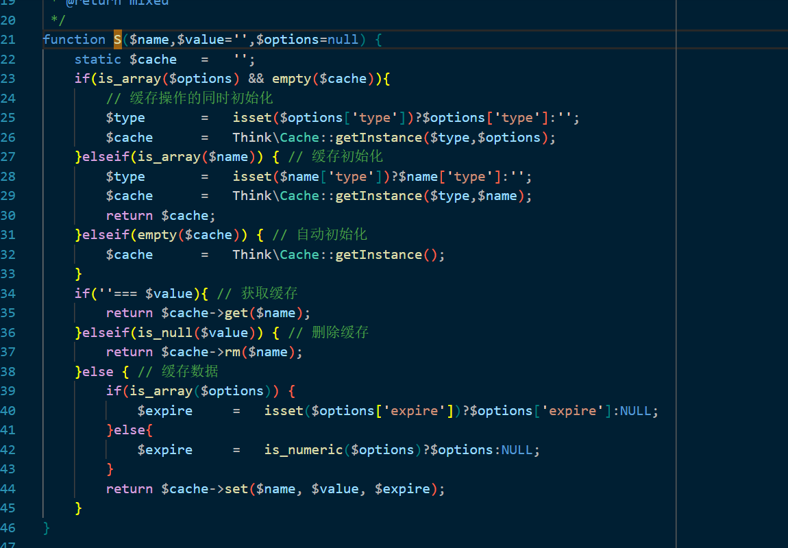
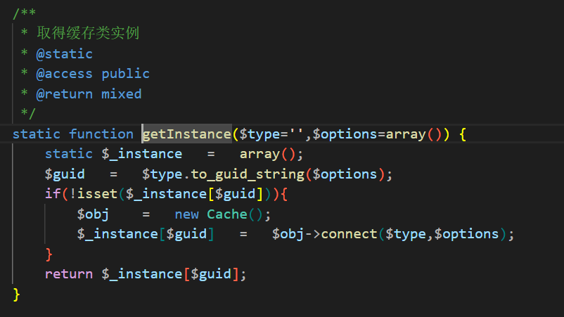
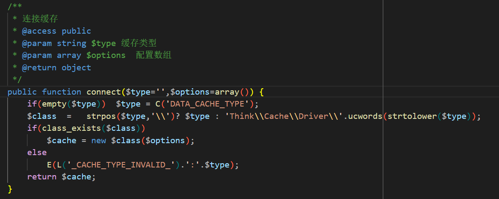
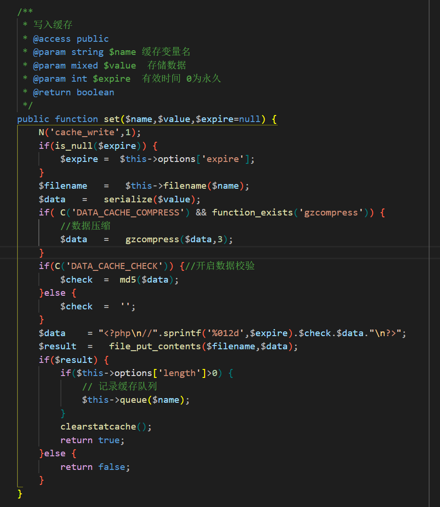
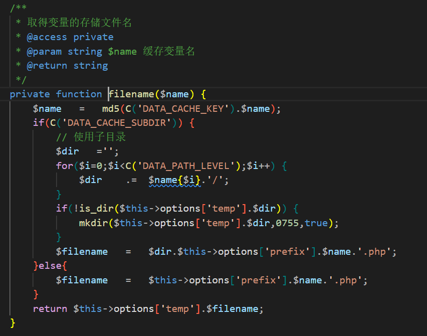
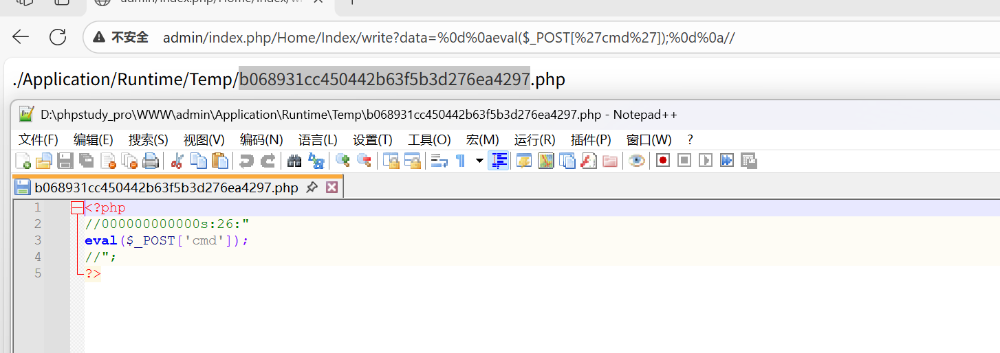

## 漏洞影响
- **版本范围**：3.2.3

## 漏洞分析
ThinkPHP 3.2.3 版本的文件缓存驱动（`Think\Cache\Driver\File`）在 `set()` 方法中，将用户输入数据序列化后直接写入以 `.php` 结尾的缓存文件，并以 PHP 行注释 `//` 开头封装内容。该机制旨在实现安全数据持久化，但未对序列化数据实施充分过滤。攻击者可利用 URL 编码的换行符 `%0d%0a` 注入绕过行注释，构造恶意 PHP 代码，从而实现远程代码执行（RCE）。

## 漏洞复现
1. 在 ThinkPHP 3.2.3 版本的标准控制器中使用 `I()` 辅助函数获取用户输入参数，并通过 `S()` 辅助函数 `S('name', $writeData)` 将其写入缓存文件。

2. 在 `S()` 辅助函数中，传入参数为 `($name = 'name', $value = 'payload', $options = null)`，该调用绕过函数的前两个条件分支，直接执行 `Think\Cache::getInstance()` 以实例化缓存驱动类。由于 `$value` 非空，进入最后一个分支，调用 `$cache->set($name, $value, $expire)`，其中参数分别为 `($name = 'name', $value = 'payload', $expire = NULL)`。

3. 在 `Think\Cache::getInstance()` 调用中，`Cache` 类的静态方法 `getInstance()` 实例化一个 `Cache` 对象，并调用其 `connect()` 方法。

4. 在 `connect()` 方法中，`$type` 变量通过 `C('DATA_CACHE_TYPE')` 获取配置值，默认值为 `File`。随后，`$class = strpos($type, '\\') ? $type : 'Think\\Cache\\Driver\\' . ucwords(strtolower($type))` 构建类名为 `Think\Cache\Driver\File`。通过 `new $class($options)` 实例化 `File` 类并返回。

5. `S()` 辅助函数中的 `$cache->set($name, $value, $expire)` 即为 `File::($options)->set($name, $value, $expire)`。`set()` 方法对数据进行序列化、压缩（`DATA_CACHE_COMPRESS` 默认值为 `false`）和格式化处理后，写入由 `$this->filename($name)` 方法生成的文件。

6. `DATA_CACHE_KEY` 和 `DATA_CACHE_SUBDIR` 配置项在 ThinkPHP 中的默认值为 `''` 和 `false`，因此绕过 `filename()` 方法的第一个分支。文件名生成逻辑简化为 `$filename = $this->options['prefix'] . md5($name) . '.php'`。由于未传入 `$this->options['prefix']` 和 `$this->options['temp']`，实际值分别从配置文件中获取 `C('DATA_CACHE_PREFIX')`（默认为空）和 `C('DATA_CACHE_PATH')`（默认路径为 `./Application/Runtime/Temp/`）。

7. 尽管代码对数据执行了 `$data = "<?php\n//" . sprintf('%012d', $expire) . $check . $data . "\n?>";` 的格式化封装，但通过代码执行路径追踪可知，代码未实施进一步的输入处理与过滤。因此，利用 `%0d%0a` 构造换行符即可绕过注释符。

