## 漏洞影响
- **受影响版本**：ThinkPHP = 5.0.10

## 漏洞分析
ThinkPHP 特定版本在 `Builder` 类的 `parseWhereItem` 方法中程序未对用户输入进行充分过滤，直接拼接进 SQL 语句，同时 `Request` 类的 `filterValue` 方法遗漏了对 `NOT LIKE` 关键字的过滤，导致攻击者可通过数组参数构造恶意查询绕过表达式限制执行 `UNION` 注入，泄露数据库信息。

## 漏洞复现

1. 控制器类接收用户输入的数组参数，并构造 `['username' => $username]` 的关联数组传入 `Query` 数据库查询类的 `where` 方法，随后通过链式调用 `select` 方法执行查询。

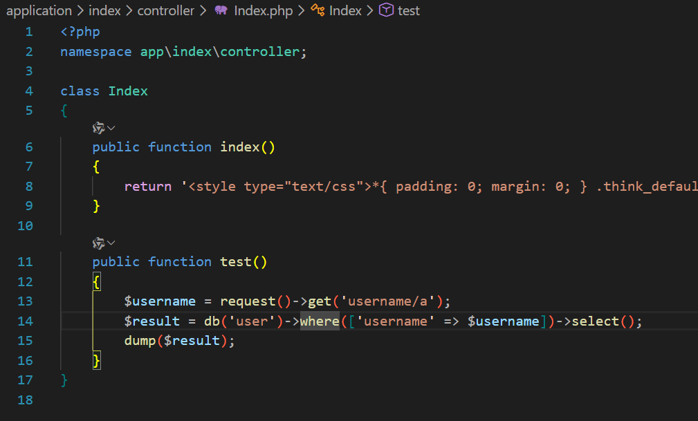

2. `where` 方法内部调用 `$this->parseWhereExp('AND', $field, $op, $condition, $param = [])` ，其中 `$field` 为用户传入的关联数组，`$op` 和 `$condition` 参数为 `null`。

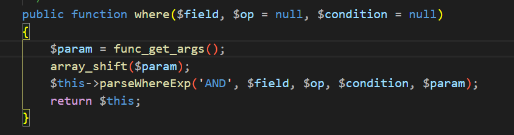

3. `parseWhereExp` 方法中，逻辑匹配分支为 `elseif (is_null($op) $$ is_null($condition))` ，该分支初始化 `$where` 变量并将用户参数赋值，后续通过循环遍历将其存储至 `$this->options['multi'][$logic][$key][]`。

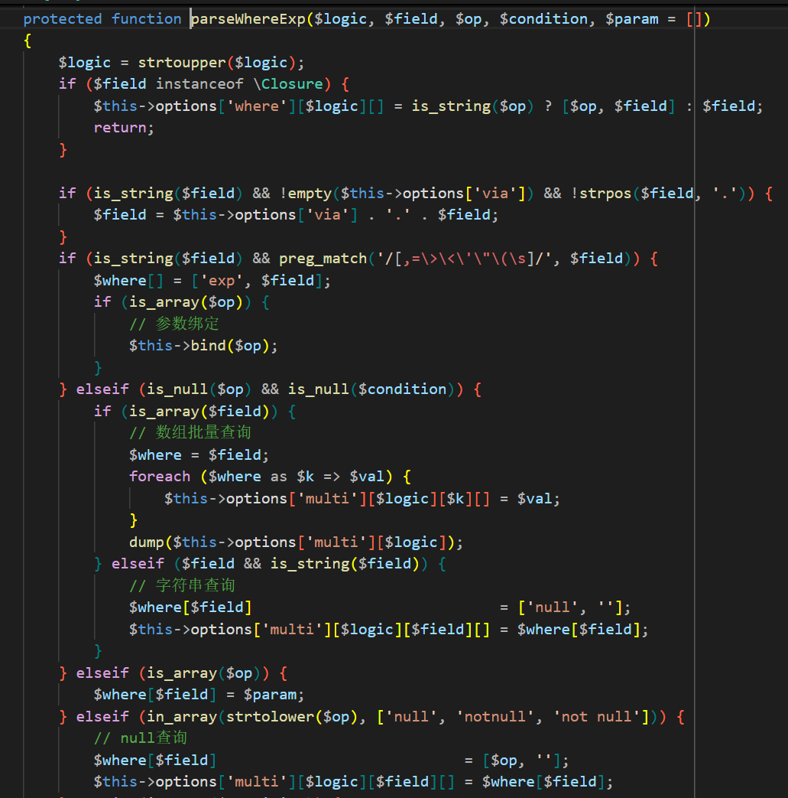

4. 由于 `$where` 非空，因此进入 `if (!empty($where))` 分支，利用 `array_merge` 函数将 `$where` 合并至 `$this->options['where'][$logic]` 数组中。

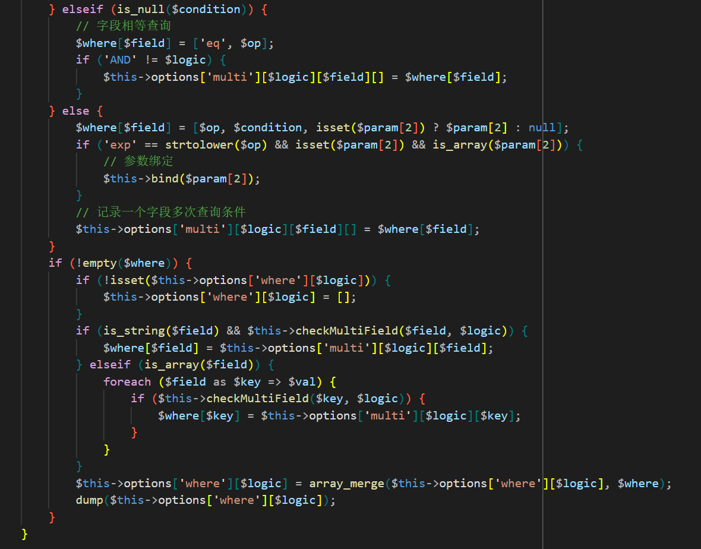

5. `where` 方法执行完毕，链式调用 `select` 方法，该方法前半部分对于 `$data` 参数的处理与漏洞无关，后半部分通过调用 `$this->builder->select($options)` 构建查询 SQL。

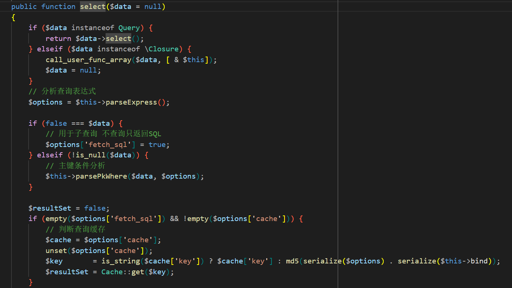

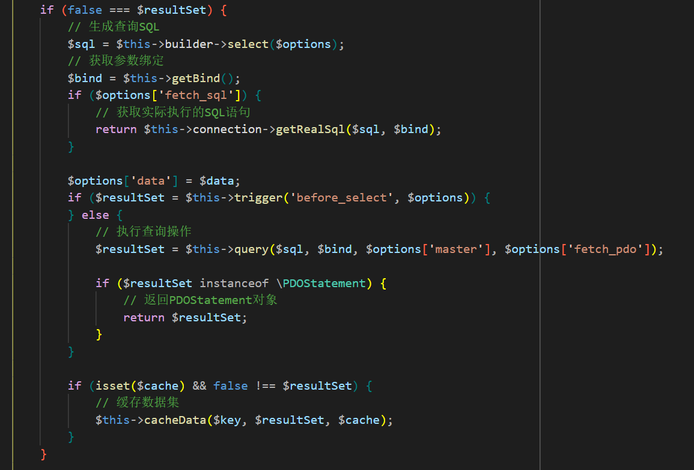

6. 在 `Builder` 类的 `select` 方法中，调用 `$this->parseWhere($options['where'], $options)` 方法处理 `where` 方法传入的数组。该方法初始化 `$whereStr` 变量用来拼接查询 SQL，其中 `$whereStr = $this->buildWhere($where, $options)` 的结果为空，导致 `$whereStr = $whereStr ? '( ' . $whereStr . ' ) AND ' : ''`的结果也因此为空，最后调用 `$this->parseWhereItem($field, $condition, '', $options, $binds)` 方法构建表达式。

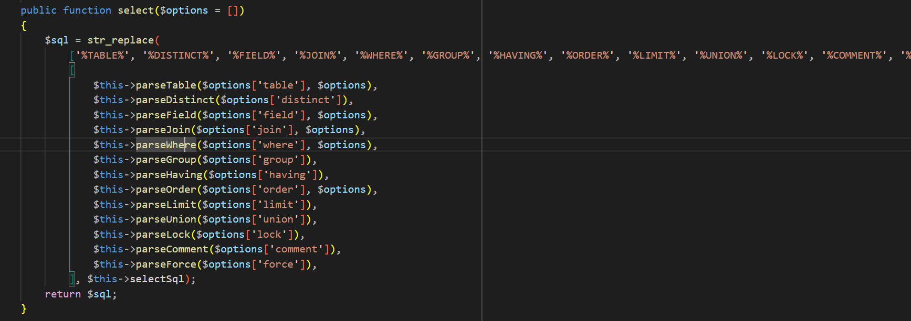

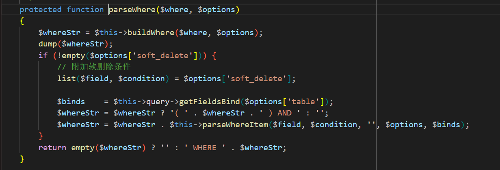

7. 在 `parseWhereItem` 方法中可以看到多项 SQL 拼接逻辑，大部分的拼接逻辑都有 `$this->parseValue` 方法过滤或是在请求传参时由 `Request` 类的 `input` 方法过滤关键字。而在 `elseif ('LIKE' == $exp || 'NOT LIKE' == $exp)` 分支， `$whereStr .= '(' . implode($array, ' ' . strtoupper($logic) . ' ') . ')'` 无过滤拼接。

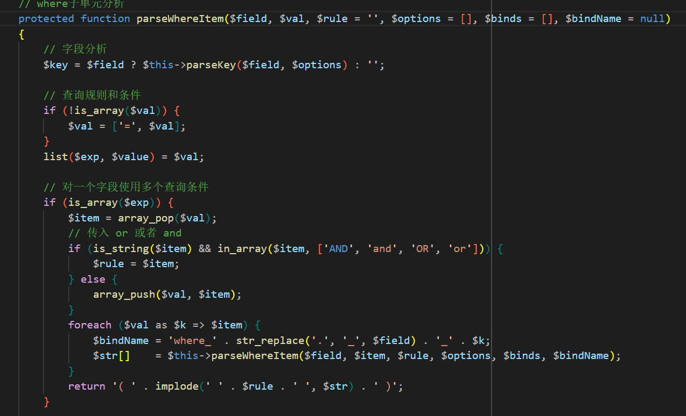

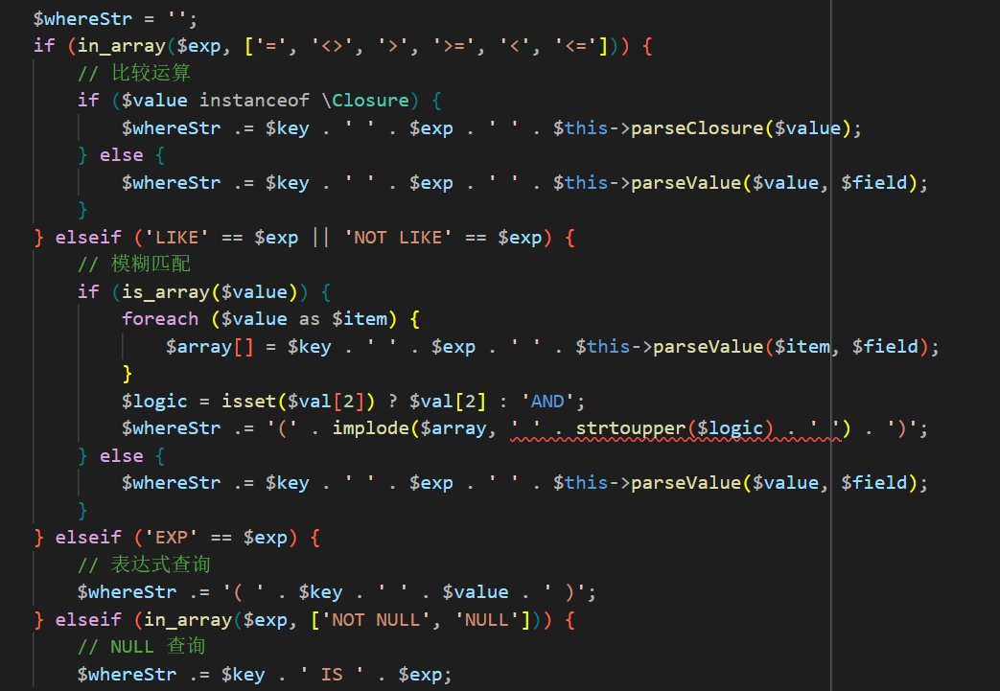

8. 在 `Request` 类的 `filterExp` 过滤方法中，开发人员把 `NOT LIKE` 的过滤误写成了 `NOTLIKE` ，导致过滤无效。

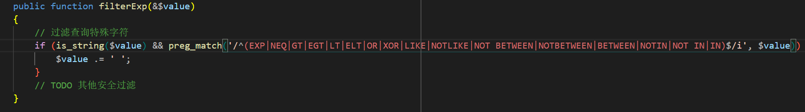

9. 漏洞验证。

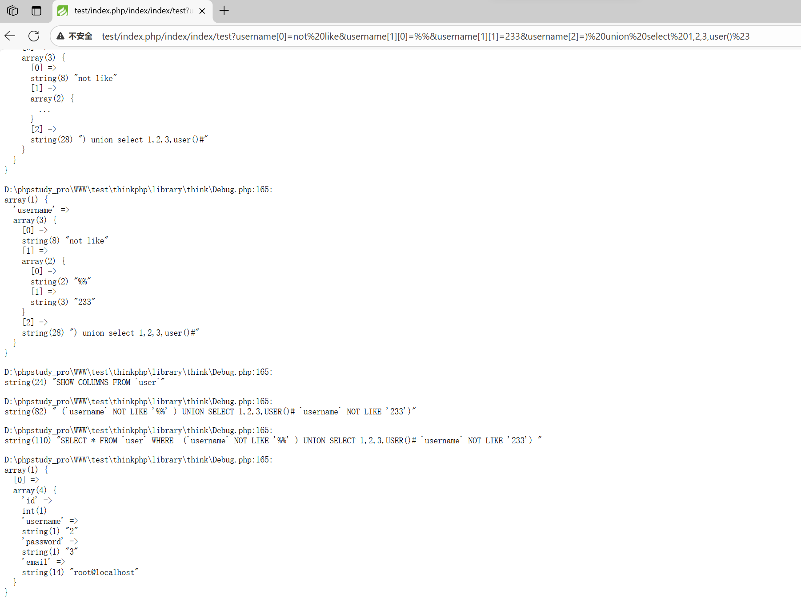