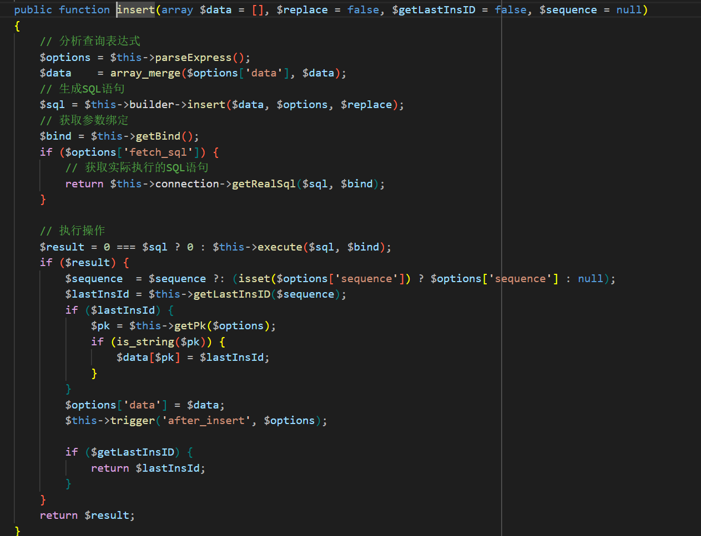
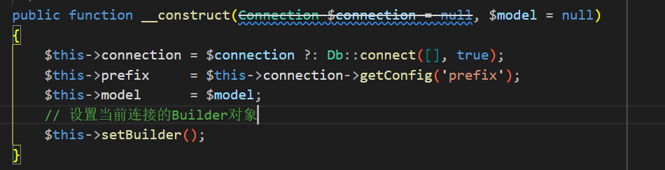
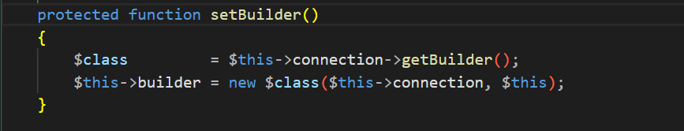
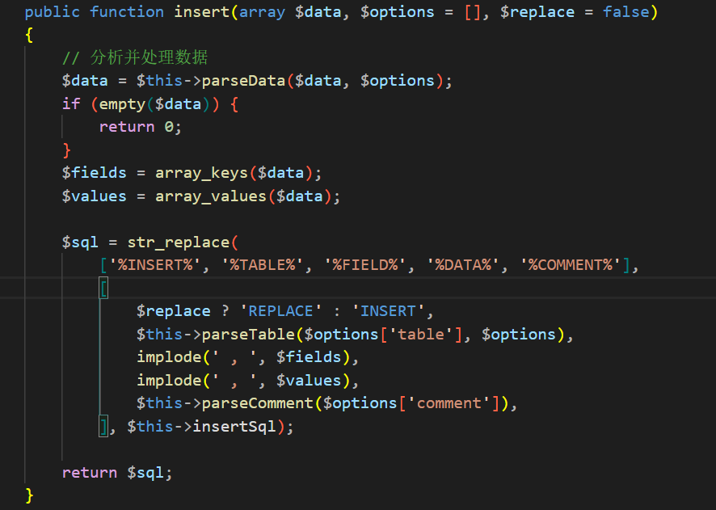
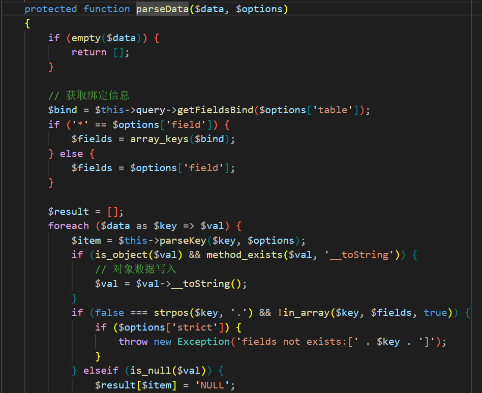
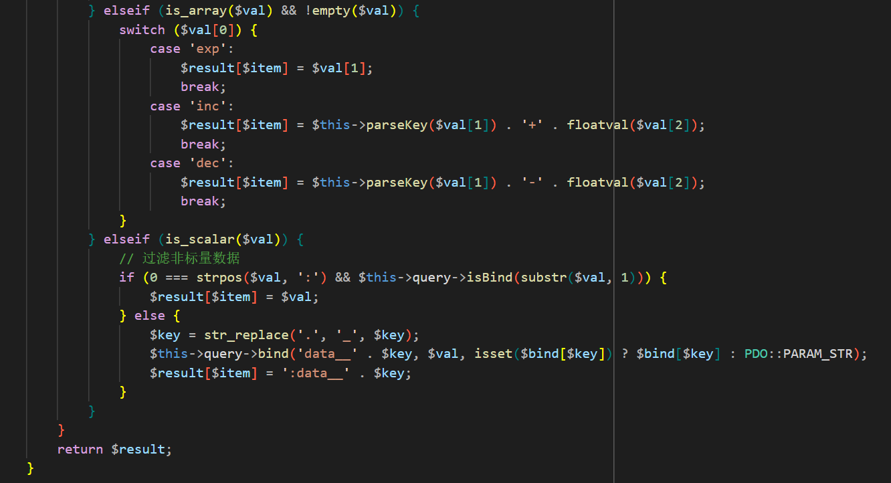
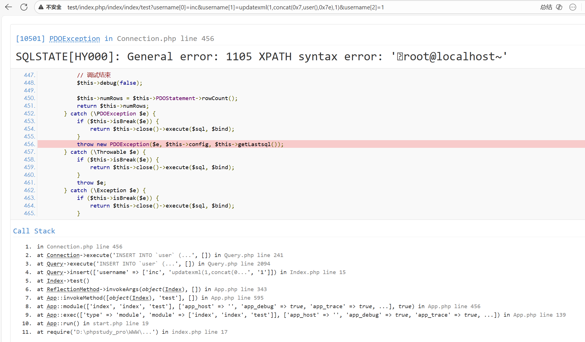

## 漏洞影响
- **受影响版本**：5.0.0 ≤ ThinkPHP ≤ 5.0.15
- **受影响版本**：5.1.0 ≤ ThinkPHP ≤ 5.1.5

## 漏洞分析
在 ThinkPHP 特定版本中，`insert()` 方法调用 `think\db\builder\Builder::parseData()` 处理数组输入数据，其内部 `switch` 结构对 `$val[1]` 缺乏适当转义，导致SQL注入漏洞。

## 漏洞复现

1. 特定版本的 Thinkphp 在使用 `insert` 方法接收用户可控数组参数时，即可触发SQL注入漏洞。

2. `insert` 方法内通过 `array_merge` 函数将 `$this->parseExpress()` 解析的表达式数组与用户输入合并，在无链式调用场景下，表达式解析结果的 `data` 应为空数组，随后调用 `$this->builder->insert($data, $options, $replace)` 生成 insert SQL 语句。

3. `$this->builder` 对象的实例化逻辑在 `Query` 类的构造方法中是 `$this->getConfig('builder') ?: '\\think\\db\\builder\\' . ucfirst($this->getConfig('type'))` 在本环境下，该实例对应 `Mysql` 类。

4. `Mysql` 驱动类没有定义 `insert` 方法，从它的父类 `Builder` 类中查找。可以看到 `insert` 方法通过 `$this->parseData($data, $options)` 解析用户输入，使用 `array_keys($data)` 和 `array_values($data)` 分别提取用户输入的键与值，并通过 `str_replace` 构造类似于 `INSERT INTO users (username) VALUES (payload)` 的SQL语句。因此只要 `parseData` 方法过滤不严，即可造成注入。

5. `parseData` 方法使用 `foreach ($data as $key => $val)` 遍历用户输入，若 `$val` 为非空数组，进入 `elseif (is_array($val) && !empty($val))` 分支。该分支语句没有任何过滤，当 `val[0] === 'inc'` 时即可执行 `$result[$item] = $this->parseKey($val[1]) . '+' . floatval($val[2])` 对用户输入进行拼接并保存至 `$result` 数组。`parseKey` 只负责解析输入，并不负责过滤。最后 `return $result` 将带有恶意数据的数组返回，造成注入。

6. 漏洞验证。 `inc` 或 `dec` 的 `switch` 分支都可以造成注入，`exp` 则因为在 `Request` 类中会被过滤函数替换成 `exp` 加空格而无法匹配分支。 

