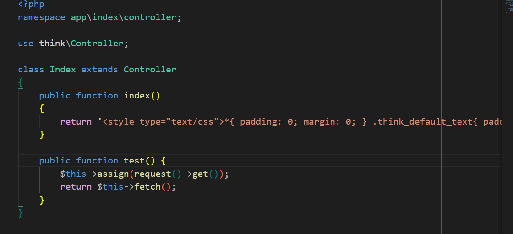
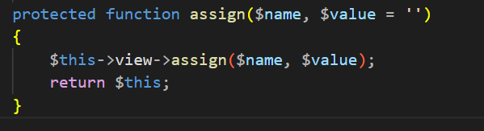
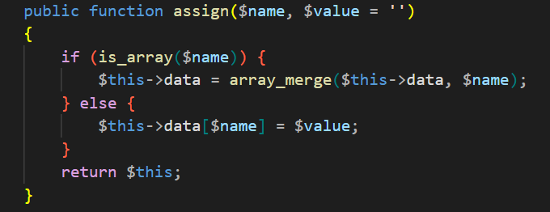
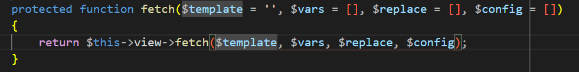
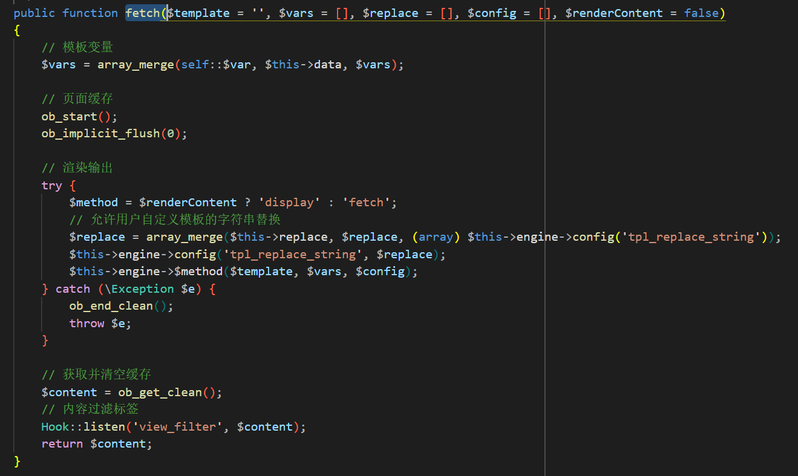
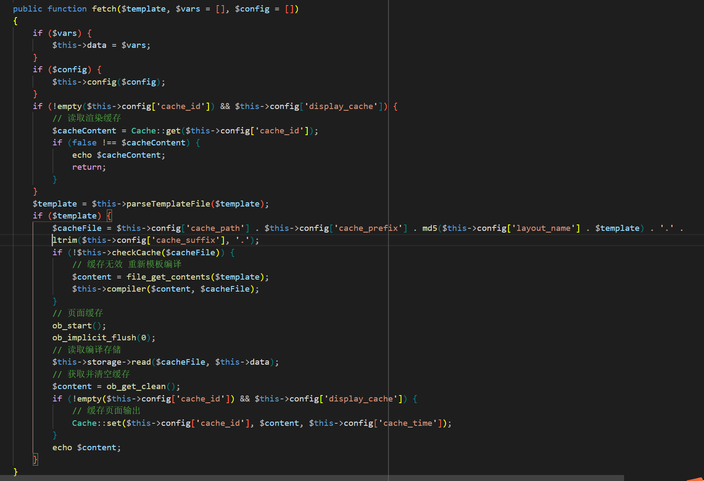
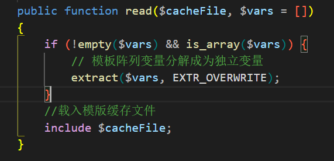
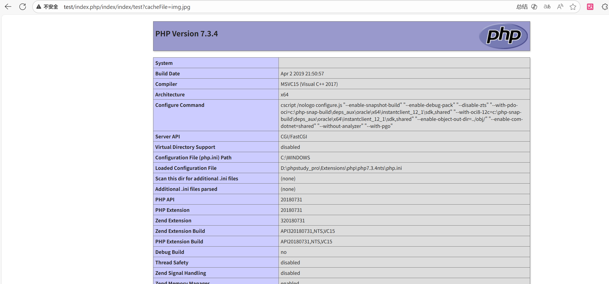

## 漏洞影响
- **受影响版本**：5.0.0 ≤ ThinkPHP ≤ 5.0.18
- **受影响版本**：5.1.0 ≤ ThinkPHP ≤ 5.1.10

## 漏洞分析
ThinkPHP 模板引擎在加载模板变量时，使用 `extract($vars)`  函数解析用户输入，导致 `$cacheFile` 变量被覆盖，未过滤数据可注入恶意路径，实现本地文件包含，可能导致敏感信息泄露或代码执行。

## 漏洞复现
1. 控制器通过 ` $this->assign(request()->get()) ` 将用户 GET 参数（如 `cacheFile=demo.php`）利用 `array_merge` 函数合并至视图对象的 `$this->data` 属性。

2. 随后，控制器调用 `fetch` 方法，该方法委托视图对象的同名方法执行。在 `View` 类中，`$vars = array_merge(self::$var, $this->data, $vars);` 语句将用户参数注入 `$vars` 变量。由于 `$renderContent` 参数默认为 `false` ，`$method` 变量解析为 `'fetch'` ， `$this->engine->$method(...)` 这条方法的实际调用为 `$this->engine->fetch(...)`。

3. 视图对象的 `$engine` 属性是 `Template` 模板类的实例。该实例的 `fetch` 方法首先通过 `$this->data = $vars;` 将用户参数持久化至对象的 `$data` 属性，而后在 `$this->storage->read($cacheFile, $this->data);` 调用中传递该属性。

4. 通过调试，可以得知模板对象的 `$storage` 属性是 `think\template\driver\File` 类的实例，该类的 `read` 方法中，有一句 `extract($vars, EXTR_OVERWRITE);` ，下面紧接着就是 `include $cacheFile;`。`extract` 函数从数组中将变量导入到当前的符号表，PHP符号表的意思是当前执行作用域中所有变量的内部存储和管理结构，用于记录变量名（键）和变量值（值）的映射关系，简单来说，它就像一个“变量字典”，跟踪脚本运行时当前环境中可用的所有变量。通过 `extract` 函数，PHP可以将一个命名数组按照命名数组键值对的关系创建相应的变量，在使用方法上类似于 javascript 的对象解构或 java 的map迭代。EXTR_OVERWRITE参数的意思是，如果有冲突，则覆盖已有的变量。因此假如用户传入 `?cacheFile = 'evil.jpg'` ，`request()->get()` 返回的是一个参数/值对应关系的命名数组，它符合 `if (!empty($vars) && is_array($vars))` 条件，进入分支语句，通过覆盖 `$cacheFile` 变量造成文件包含漏洞。

5. 验证成功。

