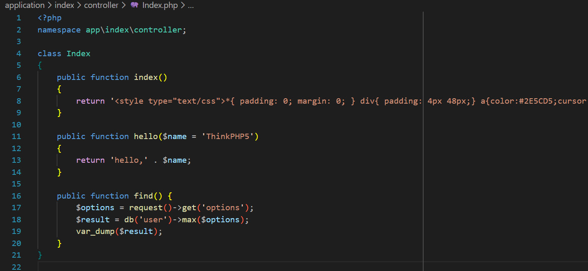
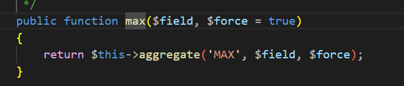
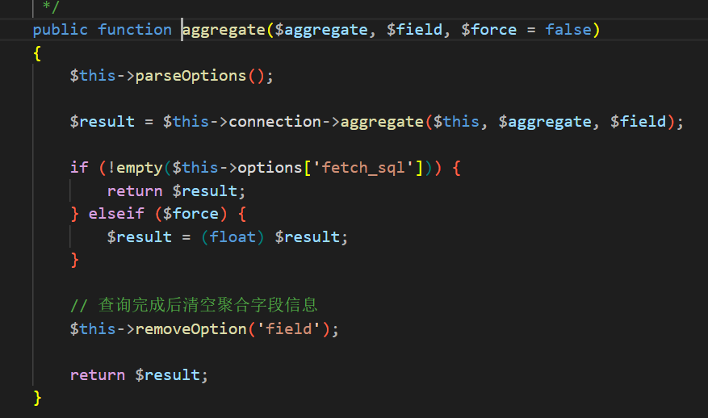
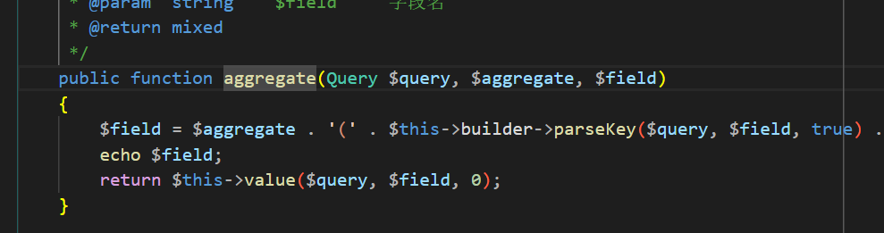
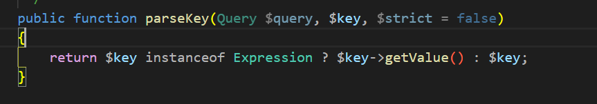
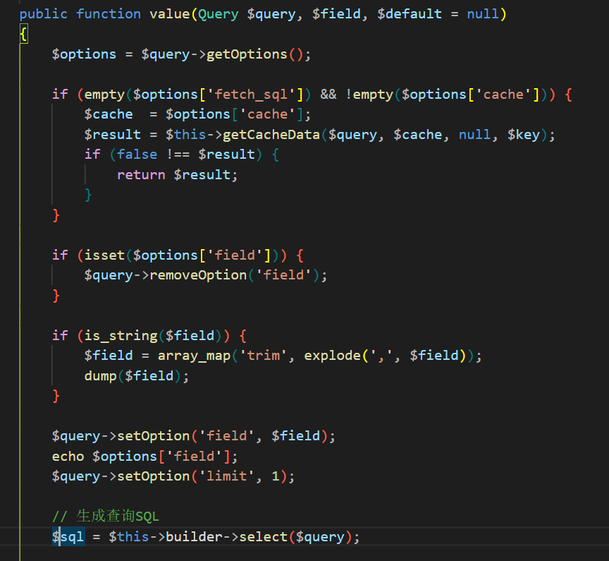
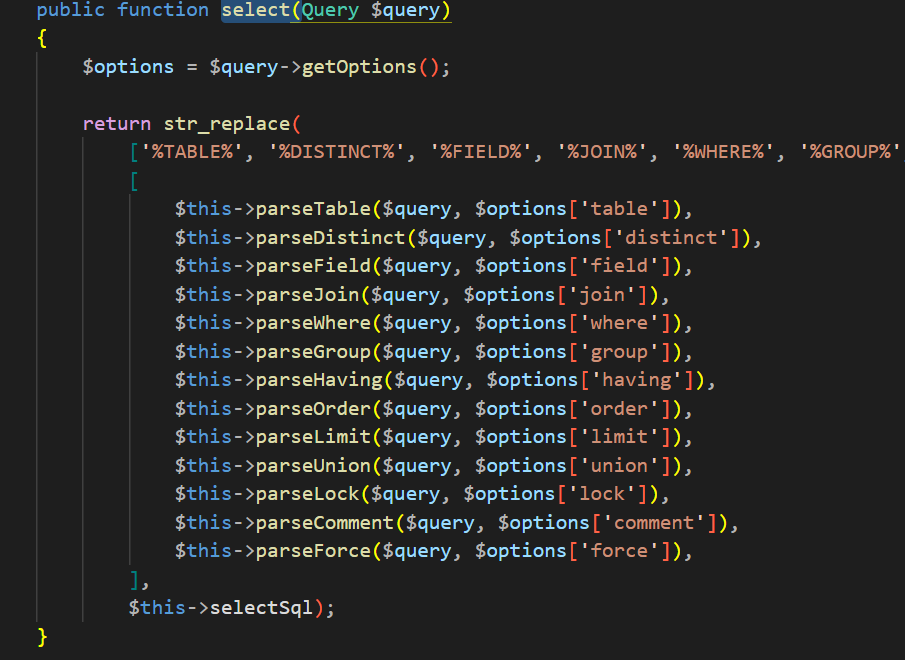
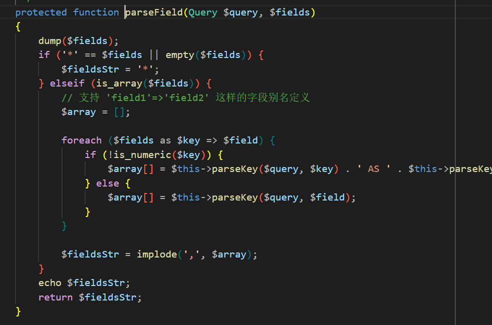

## 漏洞影响
- **受影响版本**：5.0.0 ≤ ThinkPHP ≤ 5.0.21
- **受影响版本**：5.1.3 ≤ ThinkPHP ≤ 5.1.25

## 漏洞分析
ThinkPHP 指定版本的 MySQL 聚合函数（如 `max()`、`sum()` 等）存在 SQL 注入漏洞。该漏洞源于用户输入字段参数缺乏严格输入验证和参数化处理，直接通过字符串拼接嵌入 SQL 语句，从而允许攻击者注入恶意 SQL 代码。所有依赖底层 `aggregate` 方法的聚合查询均受影响。

## 漏洞复现
1. 漏洞入口点位于 `max()` 等聚合函数的调用。若用户可控参数未经充分过滤，直接传入 `Query` 类的 `max` 方法，即可触发 SQL 注入。

2. 考察 `Query` 类的 `max` 方法：该方法首先调用 `aggregate` 方法处理聚合表达式。随后，通过 `$this->parseOptions();` 解析查询选项，并利用 `$result = $this->connection->aggregate($this, $aggregate, $field);` 委托底层连接器构建 SQL 语句，实现聚合计算。

3. 在 `Connection` 类的 `aggregate` 方法中，关键风险在于对用户输入 `$field` 的处理：通过 `$field = $aggregate . '(' . $this->builder->parseKey($query, $field, true) . ') AS tp_' . strtolower($aggregate);` 进行直接字符串拼接，仅施加基本键名解析（`parseKey`），未实施转义或白名单验证。随后，该拼接片段传入 `$this->value($query, $field, 0);` 方法。

4. `value` 方法对传入的 SQL 片段执行预处理：利用 `$field = array_map('trim', explode(',', $field));` 按逗号分割并去除空白。随后，通过 `$query->setOption('field', $field);` 更新查询对象的 `options` 属性（即 `$this->options['field'] = $field;`），最终调用 `$sql = $this->builder->select($query);` 生成完整查询语句。

5. `Builder` 类的 `select` 方法从查询对象提取选项：`$options = $query->getOptions();` 获取 `options` 数组。对于聚合函数，核心生成逻辑依赖 `$this->parseField($query, $options['field'])`，该调用将用户控制的字段数组直接融入 SQL 模板。

6. `parseField` 方法对传入字段数组执行逐项处理：通过 `$array[] = $this->parseKey($query, $field);` 应用键名解析。随后，利用 `$fieldsStr = implode(',', $array);` 将数组重新拼接为逗号分隔字符串，直接绑定至 SQL 查询模板。该过程虽施加了键名包裹，但未检测或过滤非预期字符，从而允许攻击者闭合结构并注入任意 SQL 表达式。

7. 注入验证成功。

