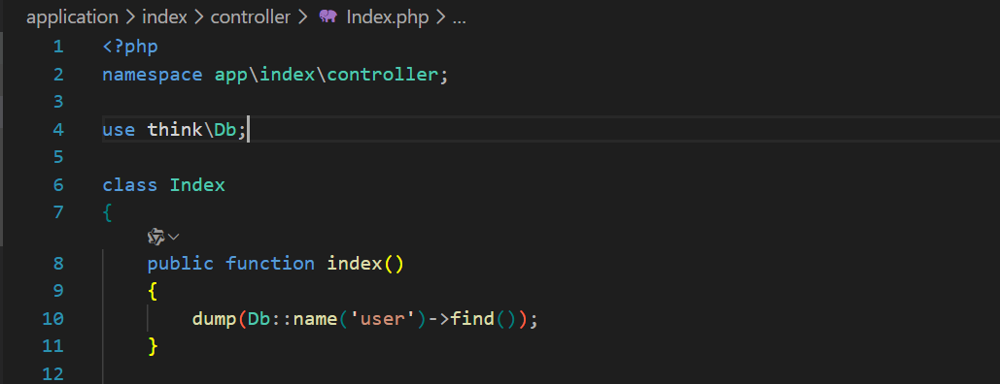
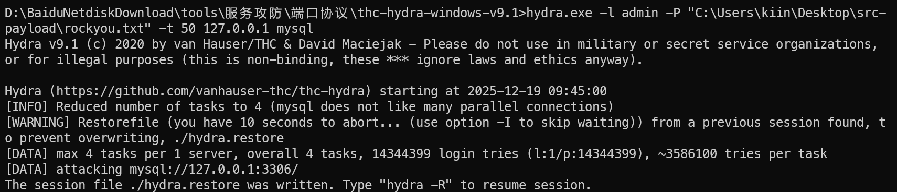
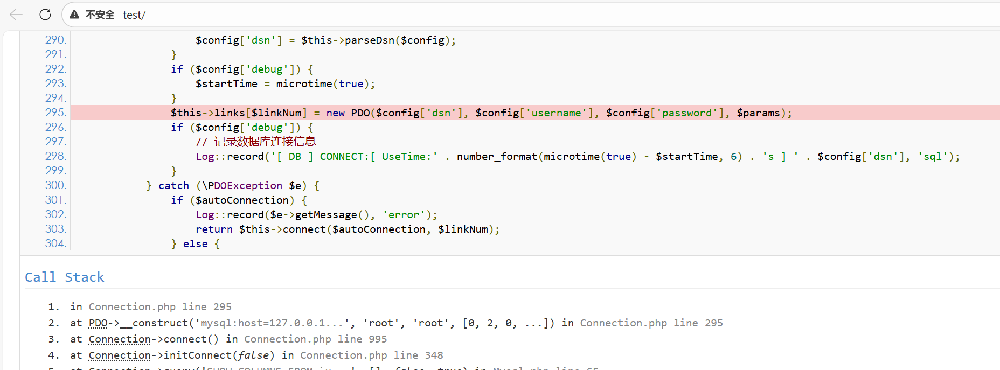

## 漏洞影响
- **受影响版本**：ThinkPHP 5.0.24

## 漏洞分析
ThinkPHP 5.0.24 版本在开启debug的模式下，可通过高线程爆破 Mysql 导致 Web 应用程序报错泄露 Mysql 账号密码。

## 漏洞复现

1. Thinkphp 连接 Mysql 数据库。

2. 使用 Hydra 对 Mysql 数据库进行爆破。

3. 在爆破的同时持续访问 Thinkphp 页面发起连接，引起报错导致账号密码泄露。

