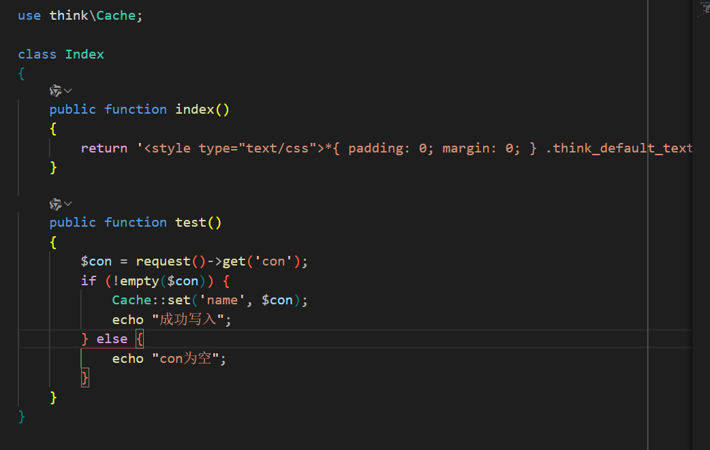
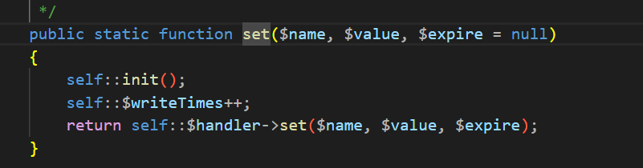
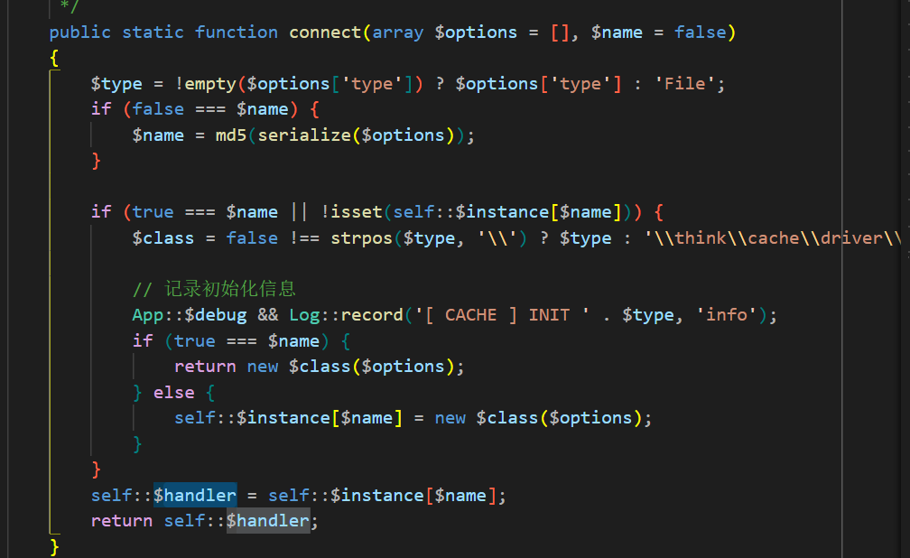
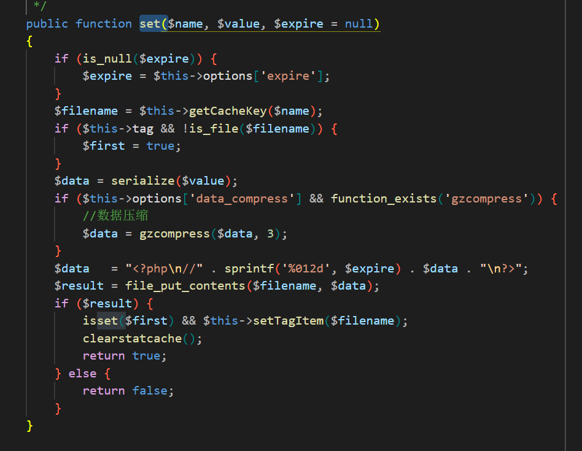
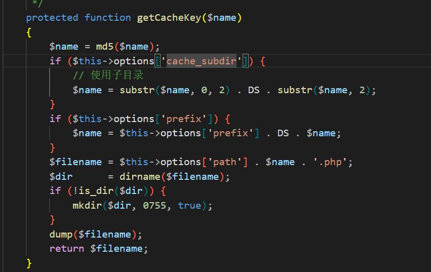
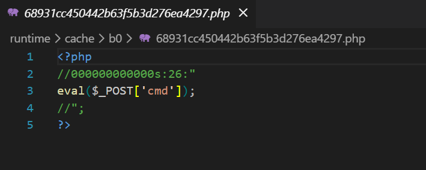
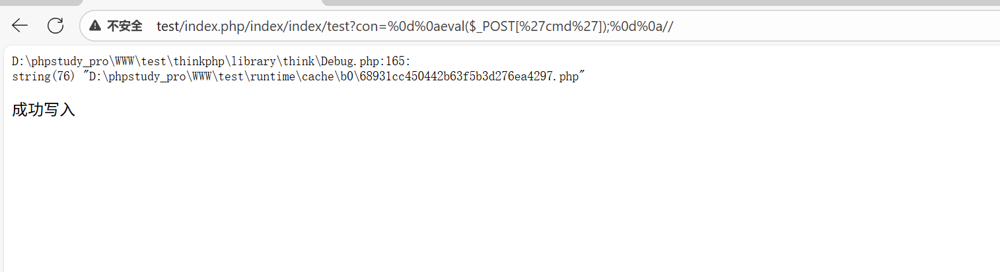

## 漏洞影响
- **受影响版本**：ThinkPHP = 5.0.5

## 漏洞分析
ThinkPHP 5.0.5 版本存在缓存文件写入漏洞，该漏洞源于 File 缓存驱动在处理用户输入时，直接将数据序列化后写入以 “.php” 结尾的缓存文件，而未对换行符进行过滤，导致攻击者可通过控制参数注入恶意 PHP 代码，绕过文件开头的注释块，从而生成可执行的 WebShell 文件，实现任意代码执行。文件的生成路径通常是 `runtime/cache/[MD5前2位]/[MD5剩余].php`。

## 漏洞复现

1. 该版本的漏洞与Thinkphp 3.2.3的缓存写入漏洞类似，通过 `Cache::set('name', $con)` 将用户控制的数据写入缓存文件。

2. `Cache` 类的 `set` 方法中，委托底层处理器执行 `self::$handler->set($name, $value, $expire)` ，`Cache` 类会在初始化时通过 `connect` 方法动态加载驱动， `$class = false !== strpos($type, '\\') ? $type : '\\think\\cache\\driver\\' . ucwords($type)` 后用 `new $class($options) ` 将 `$handler` 实例化为 `\\think\\cache\\driver\\File.php` 对象。

3. `\think\cache\driver\File` 类的 `set` 方法首先调用 `getCacheKey` 计算文件名哈希，随后对值执行序列化 `$data = serialize($value)` ，并以 `<?php\n//` 开头的格式封装内容，最终通过 `$result = file_put_contents($filename, $data)` 将未经充分转义的数据直接写入磁盘。

4. `getCacheKey` 方法使用 `md5` 函数计算 `$name` 的散列，通过 `$name = substr($name, 0, 2) . DS . substr($name, 2)` 生成MD5前2位作为目录名的目录与MD5剩余字符作为文件名的文件。

5. 漏洞验证。

