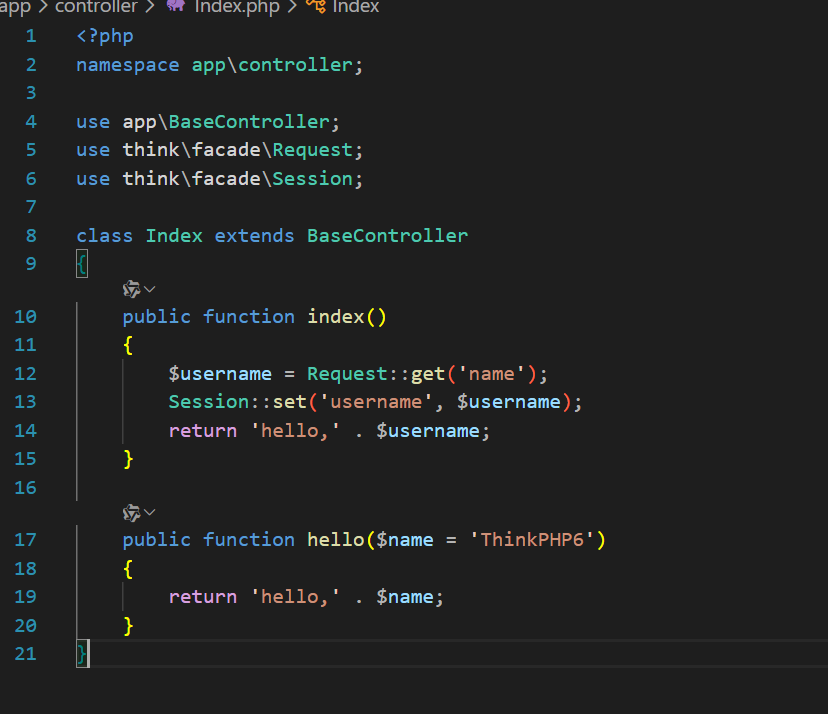
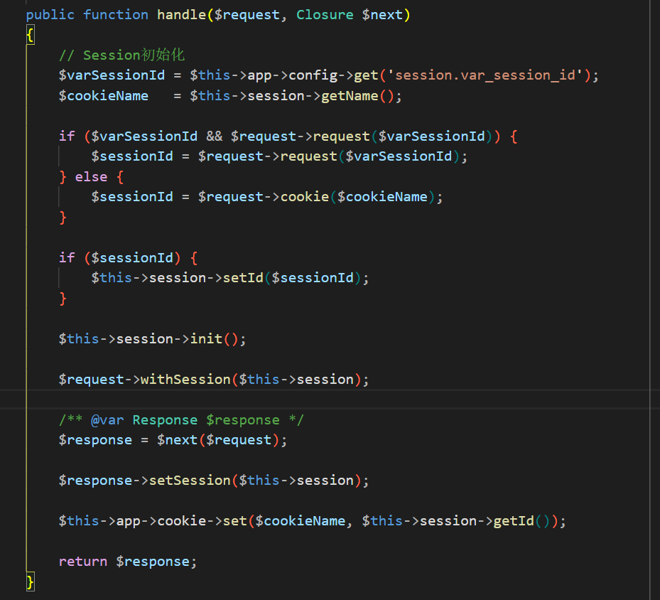
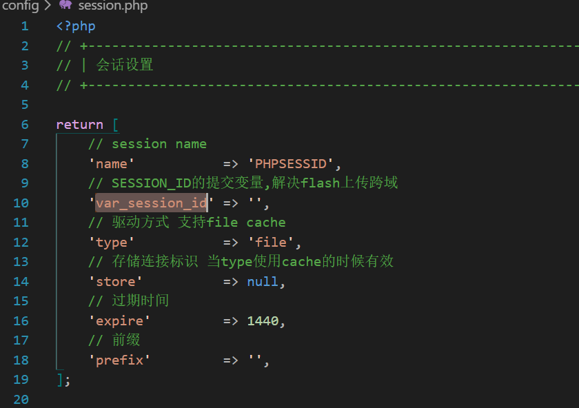
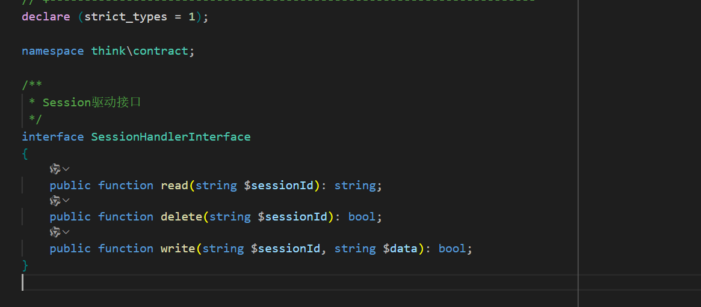
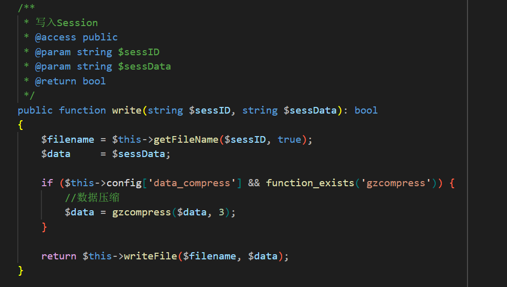
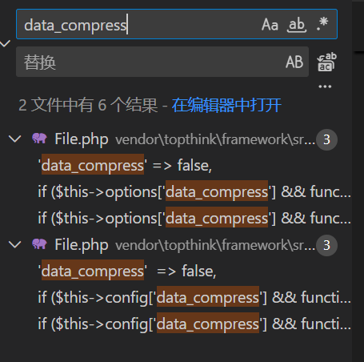
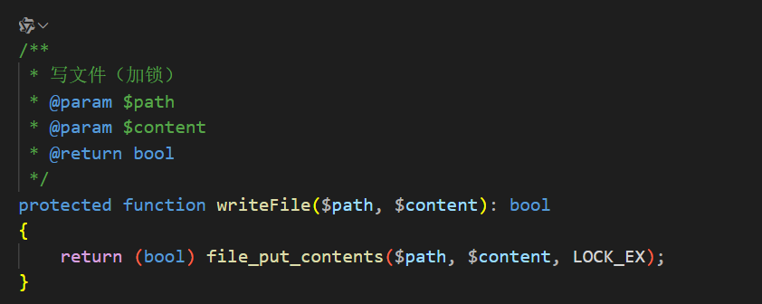
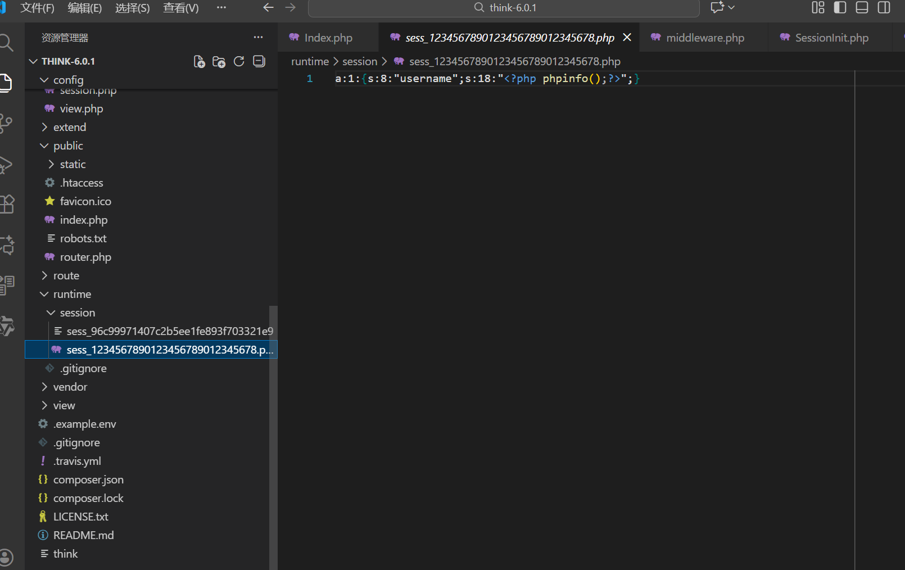

## 漏洞影响
- **受影响版本**：ThinkPHP <= 6.0.1

## 漏洞分析
ThinkPHP 6.0.2 版本之前的 Session 组件由于在设置 Session ID 时未对输入值进行 `ctype_alnum()` 等严格过滤校验，攻击者可通过 Cookie 中的 PHPSESSID 参数注入任意字符，导致 Session 数据以自定义文件名形式写入文件系统。

## 漏洞复现

1. 应用层实现设置 Session 逻辑，参数用户可控。在分析漏洞之前，首先需要了解 ThinkPHP6 的 Session 机制。ThinkPHP6 的 Session 机制入口在中间件 `\think\middleware\SessionInit` 。这个中间件负责初始化 Session，在每个HTTP请求到达时执行。`SessionInit` 中间件的处理过程如下:
   1. 检查请求中是否包含 Session ID（从请求参数或Cookie中获取）。
   2. 如果有 Session ID，则设置到 Session 实例中。
   3. 调用 `$this->session->init()` 初始化 Session 数据。
   4. 将 Session 实例注入到请求对象中。
   5. 处理完成后，将 Session ID 写入响应的 Cookie 中。
   6. ThinkPHP6 默认使用文件存储，最后使用 `$this->session->save()` 将 Session 数据保存在 `runtime/session/` 目录下。

2. 首先观察 `SessionInit` 中间件的 `handle` 方法。该方法获取 `$varSessionId` 与 `$cookieName` ，并以此作为键从请求中提取值作为 `$sessionId` 。随后调用 `$this->session->setId($sessionId)` 将  `$sessionId` 设置到 `Session` 对象中，后续的初始化、对象注入、Cookie 响应与漏洞无关。

3. 在 `config\session.php` 中，`var_session_id` 默认为空。`$cookieName` 通过 `vendor\topthink\framework\src\think\Session.php` 管理类中的 `getName()` 方法获取，该管理类通过 `return new Store($this->getConfig('name') ?: 'PHPSESSID', $handler, $this->getConfig('serialize'))`  实例化驱动类，因此实际调用的是 `vendor\topthink\framework\src\think\session\Store.php` 中的 `getName()` 方法，该方法默认返回的值是 `PHPSESSID`。

4. `Store` 类的 `setId` 方法没有对 `$sessionId` 做任何过滤，同时如果 `$sessionId` 的长度为 32 则直接直接以 ID 作为 Session 文件名。

5. 整个请求结束后，`SessionInit` 中间件调用 `end` 方法，`end` 方法中调用 `Store` 类的 `save` 方法。

6. `save` 方法获取 `$sessionId` ，如果给 Session 设置的值（即 `$username` ）不为空则调用 `$this->handler->write($sessionId, $data)` 将 `$sessionId` 与 `$username` 传入。

7. `$this->handler` 是一个接口，查看实现了该接口的类，可以发现只有 `File` 和 `Cache` 类实现了该接口。

8. 在 `File` 类的 `write` 方法中，如果 `data_compress` 配置为 `true` 会对值进行数据压缩，但该配置默认为 `false`。并再次调用 `$this->writeFile($filename, $data)` 将 `$sessionId` 和 `$username` 传入。

9. `writeFile` 方法调用 `file_put_contents($path, $content, LOCK_EX)` 将 `$sessionId` 作为文件名，将 `$username` 作为内容，写入到 Session 文件中，从而造成了任意文件写入的漏洞。

10. 漏洞验证成功。实际利用需确保暴露 runtime 目录。

